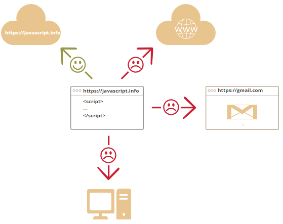

# 101 初识JavaScript


## 1. JavaScript历史

* 布兰登·艾奇（Brendan Eich，1961年～）。
* 神奇的大哥用10天完成 JavaScript 设计。
* 最初命名为 LiveScript，后来在与 Sun 合作之后将其改名为 JavaScript。


## 2. JavaScript是什么

* **JavaScript** 最初的目的是为了“**赋予网页生命**”。
* 这种编程语言我们称之为 **脚本**。它们可以写在 HTML 中，在页面加载的时候会自动执行。

```
!为什么叫JavaScript？
JavaScript 在刚诞生的时候，它的名字叫 “LiveScript”。但是因为当时 Java 很流行，所以决定将一种新语言定位为 Java 的“弟弟”会有助于它的流行。
随着 JavaScript 的发展，它已经变成了一门独立的语言，同时也有了自己的语言规范 ECMAScript。现在，它和 Java 之间没有任何关系。
```


现在，JavaScript 不仅仅是在浏览器内执行，也可以在服务端执行，甚至还能在任意搭载了 JavaScript 引擎 的设备中都可以执行。

浏览器中嵌入了 JavaScript 引擎，有时也称作 JavaScript 虚拟机。

不同的引擎有不同的“代号”，例如：

* V8 —— Chrome 和 Opera 中的 JavaScript 引擎。
* SpiderMonkey —— Firefox 中的 JavaScript 引擎。
* ……还有其他一些代号，像 “Trident”，“Chakra” 用于不同版本的 IE，“ChakraCore” 用于 Microsoft Edge，“Nitro” 和 “SquirrelFish” 用于 Safari，等等。

上面这些名称很容易记忆，因为经常出现在网上开发者的文章中。我们也会用到这些名称。例如：某个新的功能，如果“JavaScript 引擎 V8 是支持的”，那么我们可以认为这个功能大概能在 Chrome 和 Opera 中正常运行。

```
引擎是如何工作的？
引擎很复杂，但是基本原理很简单。

1.引擎（通常嵌入在浏览器中）读取（“解析”）脚本。
2.然后将脚本转化（“编译”）为机器语言。
3.然后这机器语言代码快速地运行。

引擎会对流程中的每个阶段都进行优化。它甚至可以在运行时监视编译的脚本，分析数据流并根据这些进一步优化机器代码。
```


**补充：**

浏览器分成两部分：渲染引擎和JS引擎

* 渲染引擎：用来解析HTML和CSS，俗称内核
* JS引擎：读取网页中的JS代码并对其处理后运行，比如前面的V8引擎

<p style="color:red">浏览器本身并不会执行JS代码，而是通过内置的JS引擎来执行，JS引擎执行代码时逐行解释每一句源码（转换为机器语言），然后由计算机去执行，所以JS归为脚本语言，会逐行解释执行。</p>


## 3. 浏览器中的 JavaScript 能做什么？

现代的 JavaScript 是一种“安全”语言。它不提供对内存或 CPU 的底层访问，因为它最初是为浏览器创建的，不需要这些功能。

JavaScript 的能力很大程度上依赖于它执行的环境。例如：Node.js 允许 JavaScript 读写任意文件、执行网络请求等。

浏览器中的 JavaScript 可以做与网页操作、用户交互和 Web 服务器相关的所有事情。

例如，浏览器中的 JavaScript 可以完成下面这些事：

* 在网页中插入新的 HTML，修改现有的网页内容和网页的样式。
* 响应用户的行为，响应鼠标的点击或移动、键盘的敲击。
* 向远程服务器发送网络请求，下载或上传文件（所谓 AJAX 和 COMET 技术）。
* 获取或修改 cookie，向访问者提出问题、发送消息。
* 记住客户端的数据（本地存储）。


**作用**（出自Pink老师的课件）

* 表单动态校验（密码强度检测）（JS产生最初的目的）
* 网页特效
* 服务端开发（Node.js等）
* 桌面程序（Electron）
* App（cordova）
* 游戏开发（cocos2d-js）


## 4. 浏览器中的 JavaScript 不能做什么？

为了用户的（信息）安全，在浏览器中的 JavaScript 的能力是有限的。这样主要是为了阻止邪恶的网站获得或修改用户的私人数据。

这些限制的例子有：

* 网页中的 JavaScript 不能读、写、复制及执行用户磁盘上的文件或程序。它没有直接访问操作系统的功能。

  现代浏览器允许 JavaScript 做一些文件相关的操作，但是这个操作是受到限制的。仅当用户做出特定的行为，JavaScript 才能操作这个文件。例如，把文件“拖”到浏览器中，或者通过 <input> 标签选择文件。

  JavaScript 有很多方式和照相机/麦克风或者其他设备进行交互，但是这些都需要提前获得用户的授权许可。所以，启用了 JavaScript 的网页应该不会偷偷地启动网络摄像头观察你，并把你的信息发送到 美国国家安全局。

* 不同的浏览器标签页之间基本彼此不相关。有时候，也会有一些关系。例如，一个标签页通过 JavaScript 打开另外一个新的标签页。但即使在这种情况下，如果两个标签页打开的不是同一个网站（域名、协议或者端口任一不相同的网站），他们都不能够相互通信。

  这就是“同源策略”。为了解决“同源策略”问题，两个标签页必须 都 包含一些处理这个问题的特殊的 JavaScript 代码，并均允许数据交换。本教程会讲到这部分相关的知识。

  这个限制也是为了用户的信息安全。例如，用户打开的 anysite.com网页的 JavaScript 肯定不能访问gmail.com（另外一个标签页打开的网页）也不能从那里窃取信息。

* JavaScript 通过互联网可以轻松地和当前网页域名的服务器进行通讯。但是从其他网站/域名的服务器中获取数据的能力是受限的。尽管这可以实现，但是需要来自远程服务器的明确协议（在 HTTP header 中）。这也是为了用户的数据安全。

  
  
  浏览器环境外的 JavaScript 一般没有这些限制。例如服务端的 JavaScript 就没有这些限制。现代浏览器还允许安装可能会要求扩展权限的插件或扩展。

## 5. 是什么使得 JavaScript 与众不同？

```
和 HTML/CSS 完全的集成。
使用简单的工具完成简单的任务。
被所有的主流浏览器支持，并且默认开启。
```

满足这三条的浏览器技术也只有 JavaScript 了。

这就是为什么 JavaScript 与众不同！这也是为什么它是创建浏览器界面的最普遍的工具。

此外，JavaScript 还支持创建服务器，移动端应用程序等。


## 6. 为什么学习 JavaScript?

JavaScript web 开发人员必须学习的 3 门语言中的一门：

* HTML 定义了网页的内容
* CSS 描述了网页的布局
* JavaScript 网页的行为


## 7. 比 JavaScript “更好”的语言

不同的人喜欢不同的功能，JavaScript 的语法也不能够满足所有人的需求。

这是正常的，因为每个人的项目和需求都不一样。

所以，最近出现了很多不同的语言，这些语言在浏览器中执行之前，都会被 编译（转化）成 JavaScript。

现代化的工具使得编译速度非常快速且透明，实际上允许开发人员使用另一种语言编写代码并将其自动转换为 JavaScript。

这些编程语言的例子有：

* CoffeeScript 是 JavaScript 的语法糖，它语法简短，明确简洁。通常使用 Ruby 的人喜欢用。
* TypeScript 将注意力集中在增加严格的数据类型。这样就能简化开发，也能用于开发复杂的系统。TypeScript 是微软开发的。
* Flow 也添加了数据类型，但是以一种不同的方式。由 Facebook 开发。
* Dart 是一门独立的语言。它拥有自己的引擎用于在非浏览器环境中运行（如：手机应用），它也能被编译成 JavaScript 。由 Google 开发。

还有很多其他的语言。当然，即使我们在使用这些语言，我们也需要知道 JavaScript。因为学习 JavaScript 可以让我们真正明白我们自己在做什么。

<p style="color:red">那些语言<strong>“净整那些没有用的”</strong>，最终还是要编译成 JavaScript ！！</p>


## 8. JavaScript由哪些部分组成

**由三部分组成：**

* **ECMAScript (核心)**

  提供核心语言功能,是核心，规定了这们语言的书写规范。

  ```
  let baakseng="Javascripter";
  ```

* **DOM (文档对象模型)**

  提供访问和操作网页内容的方法和接口,(document object model 简称DOM 文档对象模型)

  ```
  var oDiv=document.getElementById("div1");
  oDiv.innerText="现在已经被我占领了";
  ```

* **BOM (浏览器对象模型)**

  提供与浏览器交互的方法和接口；BOM最蛋疼的部分是没有统一的标准；从根本上讲BOM只处理浏览器窗口和框架,(browser object model 简称 BOM 浏览器对象模型)

  ```
  windows.location.href
  ```


## 总结

* JavaScript 最开始是为浏览器设计的一门语言，但是现在也被用于很多其他的环境。
* 现在，JavaScript 是一门在浏览器中使用最广、并且能够很好集成 HTML/CSS 的语言。
* 有很多其他的语言可以被编译成 JavaScript，这些语言还提供了更多的功能。最好还是了解一下这些语言，至少在掌握了 JavaScript 之后简单地看一下。