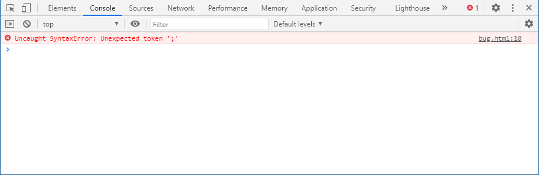

# 103 开发者控制台

代码是很容易出现错误的。你也很可能犯错误…… 哦，我在说什么？只要你是人，你一定会犯错误（在写代码的时候），除非你是机器人。

但在浏览器中，默认情况下用户是看不到错误的。所以，如果脚本中有错误，我们看不到是什么错误，更不能够修复它。

为了发现错误并获得一些与脚本相关且有用的信息，浏览器内置了“开发者工具”。

通常，开发者倾向于使用 Chrome 或 Firefox 进行开发，因为它们有最好的开发者工具。一些其他的浏览器也提供开发者工具，有时还具有一些特殊的功能，通常它们都是在追赶 Chrome 或 Firefox。所以大多数人都有“最喜欢”的浏览器，当遇到某个浏览器独有的问题的时候，人们就会切换到其他的浏览器。

开发者工具很强大，功能丰富。首先，我们将学习如何打开它们，查找错误和运行 JavaScript 命令。

## 1.1 Google Chrome浏览器

在 JavaScript 代码中有一个错误。一般的访问者看不到这个错误，所以让我们打开开发者工具看看吧。

打开 [bug.html](bug.html) 

以下方法随意：

* 按下`F12`键 (windows)
* `Ctrl` + `Shift` + `i ` (windows)
* 在页面上右键 =>“检查”

**如果用Mac，快捷键和windows有区别**

- 在这我们能看到红色的错误提示信息。这个场景中，脚本里有一个未知的红色一行命令。
- 在右边，有个可点击的链接 `bug.html:10`。这个链接会链接到错误发生的行号。
- 在错误信息的下方，有个 > 标志。它代表“命令行”，在“命令行”中，我们可以输入 JavaScript 命令，按下 Enter 来执行。

现在，我们能看到错误就够了。稍后在后面**调试**部分，会重新更加深入地学习开发者工具。

其它浏览器方法也大同小异。

Safari的可以翻阅网上查资料

## 总结

开发者工具允许我们查看错误、执行命令、检查变量等等。
在 Windows 系统中，可以通过 `F12` 开启开发者工具。

Mac 系统下，Chrome 需要使用 `Cmd` + `Opt` + `J`，Safari 使用 `Cmd` + `Opt` + `C`（需要提前开启）。