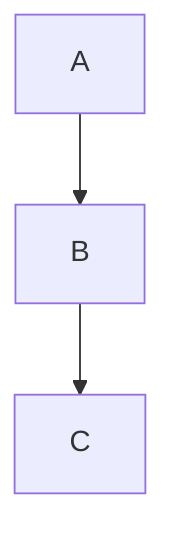
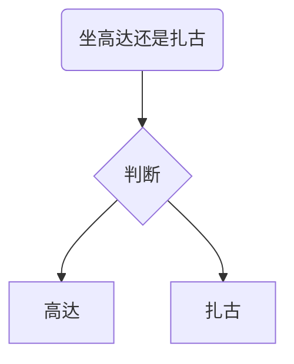
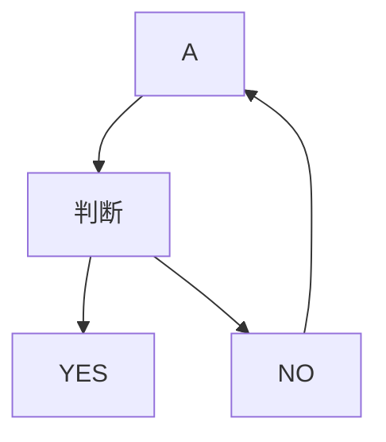

# 114 流程控制语句

# 概要

在一个程序执行的过程中，各条代码的执行顺序对程序的结果是有直接影响的。很多时候要通过控制代码的执行顺序来实现要完成的功能。
简单理解： 流程控制就是来控制代码按照什么结构顺序来执行
流程控制主要有三种结构：

* 顺序结构
* 分支结构（选择/条件）
* 循环结构

这三种结构代表三种代码执行的顺序。

# 1. 顺序结构

顺序结构是程序中最简单、最基本的流程控制，它没有特定的语法结构，程序会按照代码的先后顺序，依次执行，程序中大多数的代码都是这样执行的。

# 2. 分支（选择/条件）结构

由上到下执行代码的过程中，根据不同的条件，执行不同的路径代码（执行代码多选一的过程），从而得到不同的结果

Javascript语言提供了两种分支语句：

* if语句
* switch语句

# 3. 循环语句

循环就是重复做一件事。

循环结构是程序中一种很重要的结构，其特点是在给定条件成立时，反复执行某程序段，直到条件不成立为止。

循环语句一共有三种：

* while语句
* do...while语句
* for