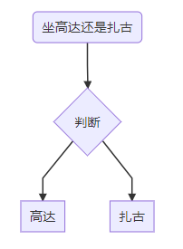
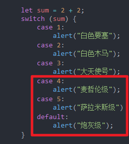
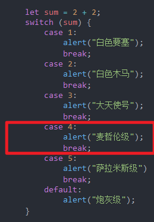
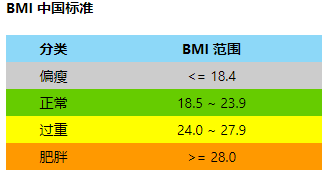
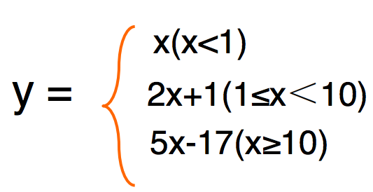
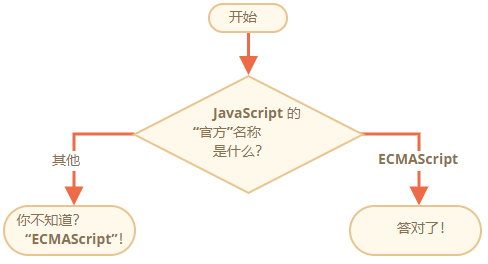
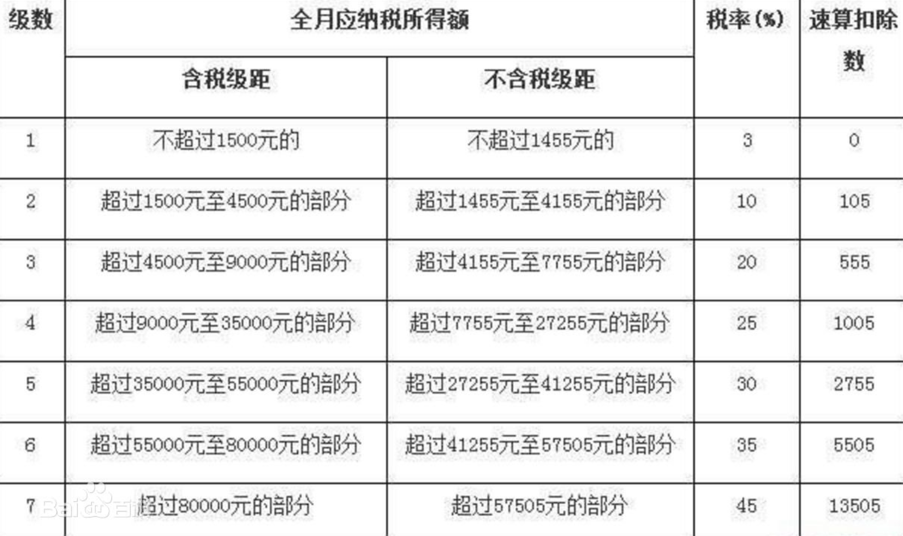

# 115 分支语句

**目录**

- [115 分支语句](#115-分支语句)
- [概要](#概要)
- [1.if语句](#1if语句)
  - [1.1 if单分支](#11-if单分支)
  - [1.2双分支](#12双分支)
  - [1.3多分支](#13多分支)
  - [1.4if嵌套](#14if嵌套)
  - [1.5布尔转换](#15布尔转换)
- [2. switch语句](#2-switch语句)
  - [2.1break的作用](#21break的作用)
  - [2.2Default关键词](#22default关键词)
  - [2.3表达式](#23表达式)
  - [2.4分组](#24分组)
  - [2.5严格相等](#25严格相等)
- [3. 对比与注意点](#3-对比与注意点)
- [4.三元运算符](#4三元运算符)
  - [4.1单个？](#41单个)
  - [4.2多个？](#42多个)
- [练习](#练习)


***

# 概要

在处理实际问题时，只有顺序结构是不够的，经常会遇到一些条件的判断， 流程根据条件是否成立有不同的流向。 

如下图所示，制造商根据机师的喜好选择高达或扎古。这种先根据机师的喜好做出判断，再决定生产高达还是扎古。这种流程结构称为**分支结构**，也称为**选择结构**。



分支语句分为以下两类：

* if语句

* switch语句


# 1.if语句

`if(...)` 语句计算括号里的条件表达式，如果计算结果是 `true`，就会执行对应的代码块。


## 1.1 if单分支

```
if(true){
       // 执行该语句       
}
if(false){
       // 跳过该语句    
}
```

例子：

```
    let inputYear = prompt("今年是哪一年？");
    if (inputYear == 2020) alert("答案正确");
```

实例：  [11501if.html](11501if.html) 

上面是个简单的例子，检查`inputYear == 2020`，如果相等则弹出模态窗。如果输入除了2020以外啥都没。

但是还能更复杂，比如输入不对会弹出“错误”的提示框：

```
    let inputYear = prompt("今年是哪一年？");
    if (inputYear == 2020) alert("答案正确");
    if (inputYear != 2020) alert("答案错误");
```

实例： [11502if.html](11502if.html) 


建议每次使用 if 语句都用大括号 `{}` 来包装代码块，即使只有一条语句。这样可以提高代码可读性。

如果有多个语句要执行，最好将要执行的代码块封装在大括号内：

```
    let inputYear = prompt("今年是哪一年？");
    if (inputYear == 2020) {
        alert("答案正确");
    }
    if (inputYear != 2020) {
        alert("答案错误");
    }
```

实例：  [11503if.html](11503if.html) 


## 1.2双分支

if语句有时会包含一个可选的 “else” 块。如果前面判断条件不成立，就会执行它内部的代码。

```
if(表达式){  
      执行语句1  
}else{  
      执行语句2  
}
```


例子：

```
    let num = prompt("请输入整数，判断是奇数还是偶数");
    if (num%2 == 0){
        alert("这是偶数");
    }else{
        alert("这是奇数");
    }
```

输入23则弹出奇数，22弹出偶数。

实例：  [11504if.html](11504if.html) 

下面代码与上面的功能完全一致，只是代码不同：

```
    let num = prompt("输入数字判断是奇数还是偶数");
    if (num%2 != 0){
        alert("这是奇数");
    }else {
        alert("这是偶数");
    }
```

num%2 ==0 是偶数，num%2 != 0是奇数

实例： [11505if.html](11505if.html) 


## 1.3多分支

```
if(表达式1){
	执行语句1;
}else if(表达式2){
	执行语句2：
}else if(表达式3){
	执行语句3;
}.....
....else{
	执行语句n;
}
```

执行过程：从上往下，满足哪个条件就执行其相对应的语句，都不满足时， 执行最后的else的语句，只能进入其中之一。

有时候双分支满足不了两个以下条件判断，就采用多分支。

成绩判定例子：85以上（含85）优秀，70到85良好（不含85），60到70（不含70）及格，60以下不及格，输入除0~100以外数字则弹出“输入错误”

```
    let score = prompt("输入分数");
    if (score >= 85 && score <= 100){
        alert("优秀");
    }else if (score >= 70 && score <85){
        alert("良好");
    }else if (score >= 60 && score < 70){
        alert("及格");
    }else if (score >= 0 && score <60){
        alert("不及格");
    }else {
        alert("输入错误");
    }
```

实例： [11506if.html](11506if.html) 


## 1.4if嵌套

```
if(表达式1){
        if(表达式2){
                if(表达式3){
                        
                }
        }
}
```

**==注意==**

* 嵌套if时，最好不要超过三层；  

* 内层的每一对if...else代码 要缩进且对齐；  

* 编写代码时，else要与最近的 if配对。

* 不如用switch...case代替


根据上面的成绩判定，95以上奖10000块，90到95（不含95）奖1000块，85到90（不含90）奖100块：

```
    let score = prompt("输入分数");
    if (score >= 85 && score <= 100){
        alert("优秀");
        if(score >=95){
            alert("奖励10000块");
        }else if(score >= 90 && score <95){
            alert("奖励1000块");
        }else {
            alert("奖励100块");
        }
    }else if (score >= 70 && score <85){
        alert("良好");
    }else if (score >= 60 && score < 70){
        alert("及格");
    }else if (score >= 0 && score <60){
        alert("不及格");
    }else {
        alert("输入错误");
    }
```

85~100会弹出两次模拟窗，第一次是优秀，第二次是奖多少钱

实例：  [11507if.html](11507if.html) 


## 1.5布尔转换

if(...)语句会计算圆括号内的表达式，并将计算结果转换为布尔型。

在运算中，和if（括号中），会发生隐式类型转换。它会将if括号中的任何形式的表达式，都自动类型转换成布尔值。--出自千锋

- 数字 `0`、空字符串 `""`、`null`、`undefined` 和 `NaN` 都会被转换成 `false`。因为他们被称为 “falsy” 值。
- 其他值被转换为 `true`，所以它们被称为 “truthy”。

所以，下面这个条件下的代码永远不会执行：

```
if (0) { // 0 是 falsy
  ...
}
```

但下面的条件 —— 始终有效：

```
if (1) { // 1 是 truthy
  ...
}
```

也可以将未计算的布尔值传入 `if` 语句，像这样：

```
let cond = (year == 2015); // 相等运算符的结果是 true 或 false

if (cond) {
  ...
}
```

实例：  [11508if.html](11508if.html) 


# 2. switch语句

switch 语句用于基于不同的条件来执行不同的动作。

请使用 switch 语句来选择要执行的多个代码块之一。

switch语句有至少一个case代码块和一个可选的 default代码块：

```
switch(n)
{
    case 1:
        执行代码块 1
        break;
    case 2:
        执行代码块 2
        break;
    case 3:
    	执行代码块 3
    	break;
   	.
   	.
   	.
    default:
        前面case全部不匹配则执行此代码
}
```

表达式的结果等于哪个case的常量，则执行其后的语句，执行 完break就跳出switch结构，都不满足则执行default的语句。

今天是星期几：

```
    let d = new Date().getDay();
    console.log(d);
    switch (d){
        case 1:
            x = "一";
            break;
        case 2:
            x = "二";
            break;
        case 3:
            x = "三";
            break;
        case 4:
            x = "四";
            break;
        case 5:
            x = "五 ";
            break;
        case 6:
            x = "六";
            break;
        case 0:
            x = "日";
            break;
    }
    alert("今天是星期" + x);
```

实例： [11509switch.html](11509switch.html) 

## 2.1break的作用

**==注意==**

* break的作用：是跳出switch结构，如果没有break，则继续执行 下面分支的的语句（而不进行判断）

不带break实例：



会连续三次弹出后面的alert()；

实例：   [11510switch.html](11510switch.html) 

都带break：



只弹出一个alert，所以建议带break

实例： [11511switch.html](11511switch.html) 

## 2.2default关键词

default 来规定匹配都不相等时执行

把上面星期一到星期日改成星期一到星期五加周末：

```
    let d = new Date().getDay();
    console.log(d);
    switch (d){
        case 1:
            x = "星期一";
            break;
        case 2:
            x = "星期二";
            break;
        case 3:
            x = "星期三";
            break;
        case 4:
            x = "星期四";
            break;
        case 5:
            x = "星期五 ";
            break;
        default:
            x = "周末";
    }
    alert("今天是" + x);
```

实例：  [11512switch.html](11512switch.html) 


## 2.3表达式

任何表达式都可以成为 switch/case 的参数，就是switch和 case 都允许任意表达式。

例子：

```
    let num = prompt("输入1-3（1高达，2扎古，3龟霸）的所属")
    let b = 0;
    switch(+num){ //把字符串转化数字型
        case b + 1:
            alert("联邦");
            break;
        case b + 2:
            alert("吉恩");
            break;
        case b + 3:
            alert("吉恩");
            break;
        default:
            alert("请输入1-3")
    }
```

实例：  [11513switch.html](11513switch.html) 


## 2.4分组

共享同一段代码的几个 `case` 分支可以被分为一组。省略break简化代码。

比如我想把上面的case 2和case 3执行同样的代码：

```
    let num = prompt("输入1-3（1高达，2扎古，3龟霸）的所属")
    switch(+num){ //把字符串转化数字型
        case 1:
            alert("联邦");
            break;
        case 2:
        case 3:
            alert("吉恩");
            break;
        default:
            alert("请输入1-3")
    }
```

实例： [11514switch.html](11514switch.html) 


## 2.5严格相等

**==!WARING==**

* switch语句在比较值时使用的是全等操作符，意味着被比较的值必须是相同的类型才能进行匹配。

例如：

```
let a = "10";
switch(a){
	case 1:
		执行代码1;
		break;
	case 10:
		执行代码10;
		break;
	.
	.
	.
}
```

其中case 10匹配不了，无法执行代码


# 3. 对比与注意点

关于条件分支 switch 和 if 两者之间的区别和关联，我们可以通过下面这个表格进行简单直观的认识与对比：

|                | switch                  | if                   |
| -------------- | ----------------------- | -------------------- |
| 判断条件       | 等值判断                | 等值判断和区间判断   |
| 结束语句       | break跳出               | 执行一个if后自动结束 |
| 默认和否则语句 | default可以放在任何位置 | else只能放在最后     |


**==注意点与建议==**

1. if后面的()不能省略，()后面不要加分号
2. if分支中即使一句话也要把{}写上
3. if嵌套不要超过三层
4. Switch语句里把default分支一定要写上，防 止在以后的维护中产生歧义
5. 把执行概率更大（正常情况）放在前面（if， case）
6. if else 一般来表示两个分支或者嵌套比较 少的分支，如果分支多的话，优先使用switch。


# 4.三元运算符

也叫三目条件运算符，要求有三个操作数，带有问号?的运算符

## 4.1单个？

语法：

```
表达式1 ? 表达式2 : 表达式3
```

执行过程：先求解表达式1，若为非0（真）则求 解表达式2，若表达式1的值是0（假），则求解表达式3。

**==注意==**

* 本质是双分支语句。

用if语句举例子：

```
    let num = 8;
    if(num % 2 ==0){
        alert("偶数");
    }else {
        alert("奇数");
    }
```

转换成三元运算符

```
num % 2 == 0 ? alert("偶数") : alert("奇数");
```

实例：   [11515wenhao.html](11515wenhao.html) 

好处是简短不少了。


可以把三元运算符的值赋值给变量：

```
    let num = prompt("输入年龄，大人还是小孩子")
    let result = (num > 17) ? "大人" : "小孩子";
    alert(result); 
```

实例：  [11516wenhao.html](11516wenhao.html) 

能把上面简化：

```
    let num = prompt("输入年龄，大人还是小孩子")
    alert("您是" + ((num > 17) ? "大人" : "小孩") + "啦！");
```

实例：  [11517wenhao.html](11517wenhao.html) 

## 4.2多个？

使用一系列问号 ? 运算符可以返回一个取决于多个条件的值。

```
let age = prompt('age?', 18);

let message = (age < 3) ? 'Hi, baby!' :
  (age < 18) ? 'Hello!' :
  (age < 100) ? 'Greetings!' :
  'What an unusual age!';

alert( message );
```

1. 第一个问号检查 `age < 3`。
2. 如果为真 — 返回 `'Hi, baby!'`。否则，会继续执行冒号 `":"` 后的表达式，检查 `age < 18`。
3. 如果为真 — 返回 `'Hello!'`。否则，会继续执行下一个冒号 `":"` 后的表达式，检查 `age < 100`。
4. 如果为真 — 返回 `'Greetings!'`。否则，会继续执行最后一个冒号 `":"` 后面的表达式，返回 `'What an unusual age!'`。

这是使用 `if..else` 实现上面的逻辑的写法：

```
if (age < 3) {
  message = 'Hi, baby!';
} else if (age < 18) {
  message = 'Hello!';
} else if (age < 100) {
  message = 'Greetings!';
} else {
  message = 'What an unusual age!';
}
```

上面是出自现代JS的教程。

下面用简单的讲解：

```
    let age = prompt("多大啦？");
    let message = (age > 100) ? "恭喜续命成功！" :
        (age > 50) ? "续命中。。。" :
        (age > 17) ? "开始续命。。。" : "小屁孩";
    alert(message);
```

实例： [11518wenhao.html](11518wenhao.html) 

输入101弹出续命成功，51岁到100岁续命中，18岁到50岁开始续命，未满18岁小屁孩。

转换成if语句：

```
    let age = prompt("多大啦");
    if(age > 100){
        alert("恭喜续命成功！");
    }else if(age >50) {
        alert("续命中。。。");
    }else if (age > 17){
        alert("开始续命");
    }else {
        alert("小屁孩")
    }
```

实例：  [11519wenhao.html](11519wenhao.html) 


**多个分支建议用if语句，不建议用问号运算符，不然眼睛累**


# 练习

**1.求两个数的的最大数**

实例： [11599test01.html](11599test01.html)  

包含检测输入是否数字和两个数是否相等。


**2.是闰年还是平年；**

四年一闰，百年不闰，四百年再闰。3200年为平年。闰年原理出自：https://www.zhihu.com/question/25388501

实例： [11599test02.html](11599test02.html) 


**3.属于哪个范围**

判断一个整数，属于哪个范围：大于0；小于0；等于0 

实例： [11599test03.html](11599test03.html) 


**4.体重浮动**

开发一款软件，根据公式（身高-108）*2=体重，可以有 10斤左右的浮动，来观察测试者体重。

实例： [11599test04.html](11599test04.html) 


**5.BMI指数**

BMI指数（即身体质量指数，简称体脂指数又称体重，英文 为Body Mass Index，简称BMI），是用体重公斤数除以身高米 数平方得出的数字，是目前国际上常用的衡量人体胖瘦程度以及 是否健康的一个标准。主要用于统计用途，当我们需要比较及分 析一个人的体重对于不同高度的人所带来的健康影响时，BMI值 是一个中立而可靠的指标。



公式：体质指数（BMI）= 体重（kg）÷身高^2（m） 例：70kg ÷（1.75×1.75）=22.86（正常）

实例： [11599test05.html](11599test05.html) 


**6.计算y的值**



有三个区间，还有检查输入的正确性

实例： [11599test06.html](11599test06.html) 


**7.它会弹出来吗**

```
if ("0") {
  alert( 'Baakseng' );
}
```

提示：[前面有](#15布尔转换)

实例： [11599test07.html](11599test07.html) ，试试if里不同参数。


**8.Javascript的名字**

使用if...else结构。



注意引号的单和双

实例： [11599test08.html](11599test08.html) 


**9.不同成绩的等级输出百分制数段**

A: 85到100, B: 70到84, C:60到69, D: 60下, 其它：error

添加了小写a~d也能输出分数段，采用toUpperCase()的方法；if(变量 = "a" || "b"||....)有效。

实例： [11599test09.html](11599test09.html) 


**10.将 switch"结构重写为 if结构**

```
    let msName = prompt("你所驾驶的机体属于哪个组织？ \n吉姆 扎古 龟霸 大魔 勇士");
    switch (msName) {
        case "吉姆":
            alert("联邦");
            break;
        case "扎古":
        case "龟霸":
        case "大魔":
        case "勇士":
            alert("吉恩");
            break;
        default:
            alert("不明组织");
    }
```

重写前的实例： [11599test10-01.html](11599test10-01.html) 

重写后的实例： [11599test10-02.html](11599test10-02.html) 


**11.将 if结构重写为 switch 结构**

```
let a = +prompt('a?', '');

if (a == 0) {
  alert( 0 );
}
if (a == 1) {
  alert( 1 );
}

if (a == 2 || a == 3) {
  alert( '2,3' );
}
```

重写前实例： [11599test11-01.html](11599test11-01.html) 

重写后实例： [11599test11-02.html](11599test11-02.html) 


**12.显示月份天数**

注意是闰年还是平年

提示：注意严格全等；2月份用switch嵌套if else。

实例： 

 [11599test12-01.html](11599test12-01.html) 用的是switch语句，2月份嵌套if语句

 [11599test12-02.html](11599test12-02.html) 用if语句


**13.表单输入的正确与否**

1. 点击保存按钮时，使用JS判断用户的联系电话是否为纯数字，如果用户输入有错误，使用 alert()弹框警告
2. 判断用户名是否填写，如果空白，使用alert弹框警告

案例： [案例.html](案例.html) 

实例： [11599test13.html](11599test13.html) 


**14.用三元运算符求两个数最大的数**

考虑到两个数相等的情况下，采用多重?

实例： [11599test14.html](11599test14.html) 


**15.个人所得税计算器**

应缴个人所得税=（工资收入- 5000）*税率 – 速算扣除数。

5000元为起征点，5000以下无需缴税。

* 例如含税工资6000，即6000 - 5000 = 1000，根据下面的表，为1级级距，计算方法：

  ( 6000 - 5000 ) * 0.03 - 0

* 如果含税工资10000，10000-5000 = 5000，为3级级距，计算方法：

  ( 10000 - 5000 ) * 0.2 - 555




实例： [11599test15.html](11599test15.html) 

结论和网上在线计算器计算的结果不一样，不管了。


**16.使用？重写if语句**

```
let result;

if (a + b < 4) {
  result = 'Below';
} else {
  result = 'Over';
}
```

重写前： [11599test16-01.html](11599test16-01.html) 

重写后： [11599test16-02.html](11599test16-02.html) 


**17.使用 '?' 重写 'if..else' 语句**

```
let message;

if (login == 'Employee') {
  message = 'Hello';
} else if (login == 'Director') {
  message = 'Greetings';
} else if (login == '') {
  message = 'No login';
} else {
  message = '';
}
```

重写前： [11599test17-01.html](11599test17-01.html) 

重写后： [11599test17-02.html](11599test17-02.html) 


