# 117 数组

**目录**
- [117 数组](#117-数组)
- [概要](#概要)
- [1. 数组的声明](#1-数组的声明)
  - [1.1有两种创建方式：](#11有两种创建方式)
  - [1.2数组元素的类型](#12数组元素的类型)
- [2.获取数组元素（访问）](#2获取数组元素访问)
- [3.遍历数组](#3遍历数组)
- [4. length长度](#4-length长度)
- [5. 新增元素](#5-新增元素)
  - [5.1通过修改length长度新增数组元素](#51通过修改length长度新增数组元素)
  - [5.2通过修改数组索引新增](#52通过修改数组索引新增)
- [6.简单的数组方法](#6简单的数组方法)
  - [6.1栈方法Stack](#61栈方法stack)
  - [6.2队列方法Queue](#62队列方法queue)
  - [6.3作用于末端的方法](#63作用于末端的方法)
  - [6.4作用于首端的方法](#64作用于首端的方法)
  - [6.5 同时添加首端和末尾](#65-同时添加首端和末尾)
  - [6.7更多的方法](#67更多的方法)
- [7.多维数组](#7多维数组)
- [总结](#总结)
- [练习](#练习)


***

# 概要

对象允许存储键值集合，这很好。

但很多时候我们发现还需要 **有序集合**，里面的元素都是按顺序排列的。例如，我们可能需要存储一些列表，比如用户、商品以及 HTML 元素等。

这里使用对象就不是很方便了，因为对象不能提供能够管理元素顺序的方法。我们不能在已有的元素“之间”插入一个新的属性。这种场景下对象就不太适用了。

这时一个特殊的数据结构数组（`Array`）就派上用场了，它能存储有序的集合。

举个例子：

* 问：之前学习的数据类型，只能存储一个值。如果我们想存储班级中所有学生的姓名，那么该如何存储呢？
* 答：可以使用数组(Array)。数组可以把一组相关的数据一起存放，并提供方便的访问(获取）方式。
* 问：什么是数组呢？
* 答：数组是指一组数据的集合，其中的每个数据被称作元素，在数组中可以存放任意类型的元素。数组是一种将一组数据存储在单个变量名下的优雅方式。

普通变量一次只能存储一个值：

```
let num = 10;
```

数组一次可以存储多个值：

```
let arr = [1, 2, 3, 4, 5]; ///不一定都是数字，可以是任意数据类型
```


总结，数组对象的作用是：使用单独的变量名来存储一系列的值。


# 1. 数组的声明

也叫创建数据。

## 1.1有两种创建方式：

* 利用 new 创建数组（也可以省略 new）：

  ```
  let 数组名 = new Array();
  let arr = new Array(); //创建一个新的空数组
  let arr = Array(); //和上面一行相同
  ```

  ```
  <script>
      let arr = new Array();
      console.log(arr); 
  </script>
  ```

  控制台console查结果：

  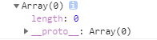

  实例： [11701Array01.html](11701Array01.html) 

  

  还有一个例子，带数值的：

  ```
  <script>
      let arr1 = new Array(123);
      console.log(arr1);
      // 一共有123个元素
  </script>
  ```

  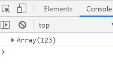

  实例： [11701Array02.html](11701Array02.html) 

  **==注意==**

  * Array() 中的A要大写！

  

* 利用数组字面量创建数组：

  * 创建空数组：

    ```
    let 数组名 = [];
    ```

  * 带初始值的数组：

    ```
    let 数组名 = ['高达', '扎古', 'GUNDAM', 'Baakseng'];
    ```

    可多行：

    ```
let 数组名 = [
    	'高达', 
  	'扎古', 
    	'GUNDAM', 
  	'Baakseng'
    	];
    ```
  ```
    
    运行结果：
    
    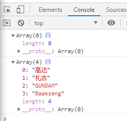
    
    实例： [11701Array03.html](11701Array03.html) 
  
  用方括号表示，数组里面的数据一定要用逗号 `,` 分隔，最右边的方括号要添加分号 `;` ；
  
  声明数组并赋值称为数组的初始化，里面的数据比如`'高达', '扎古', 'GUNDAM', 'Baakseng'`称为数组元素；
  
  这种字面量方式也是我们以后**最多使用的方式**；
  ```


## 1.2数组元素的类型

数组中可以存放任意类型的数据，例如字符串，数字，布尔值等。

```
<script>
    let arrMSG = ['Baakseng', 12, true, 15.9];
    console.log(arrMSG);
</script>
```

实例： [11701Array04.html](11701Array04.html) 


# 2. 获取数组元素（访问）

通过指定数组名以及索引号码，我们可以通过方括号 `[ ]` 访问某个特定的元素：

```
    let MS = ['RX78-01', 'MS-06A', 'GP-01', 'GP-02A'];
    console.log(MS[0]); //RX78-F01
    console.log(MS[1]); //MS-06A
    console.log(MS[2]); //GP-01
```

实例：  [11702huoqu01.html](11702huoqu01.html) 


**索引 (下标)** ：用来访问数组元素的序号（数组下标从 0 开始）。

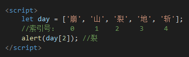

数组可以通过**索引**来访问、设置、修改对应的数组元素，可以通过 `数组名[索引]` 的形式来获取数组中的元素。

实例：  [11702huoqu02.html](11702huoqu02.html) 


甚至可以存放函数：

```
    let arr = ['RX78-02', true, function(){alert('函数');}];
    arr[2]();
```

运行结果：弹出“函数”的模态窗口

实例： [11702huoqu03.html](11702huoqu03.html) 


下标可以是变量或表达式：

```
alert(day[2 - 1]);

let b = 1;
alert(day[2 - b]);
```


# 3. 遍历数组

如何把数组里面的每一项全部取出来？可以通过 `数组名[索引号]` 的方式一项项的全部取出来。

```
let arr = ['red','green', 'blue'];
console.log(arr[0]) // red
console.log(arr[1]) // green
console.log(arr[2]) // blue
```

如果十几个或一百个以上的数组元素呢？总不能用好多好多个方括号 `[ ]`打出来。


解决方法就是用**遍历**，即循环for。

遍历: 就是把数组中的每个元素从头到尾都访问一次（类似我们每天早上学生的点名）。

可以通过 `for` 循环索引遍历数组中的每一项：

```
    let arrMS = ['GUNDAM', 'ZAKU', 'Baakseng','Gamer'];
    for(let i = 0; i < 4; i++){
        //有数组元素一共有4个，故i < 4，注意索引值是从0开始
        console.log(arrMS[i]);
    }
```

运行结果：


实例： [11703bianli01.html](11703bianli01.html) 

规律：从代码中我们可以发现，从数组中取出每一个元素时，代码是重复的，有所不一样的是**索引值**在递增。

1. 数组索引号从0开始，4个元素的话用 `i < 4`来计数（或者 `i <= 3`也可以）；
2. 输出的时候 `arrMS[i]` 中的 `i` 计数器当索引号用。


**遍历筛选案例：**

```
    let arrNumber = [1, 2, 3, 4, 5, 6, 7, 8, 9, 10];
    for(let i = 0; i < 10; i+=2){
        // 输出索引号为0、2、4。。。 采用i+=2的方法
        console.log(arrNumber[i]);
    }
```

实例： [11703bianli02.html](11703bianli02.html) 


# 4. length长度

使用“数组名.length”可以访问数组元素的数量（数组长度）。  

```
    let arr1 = ['东', '南', '西', '北'];
    let arr2 = [];
    console.log(arr1.length);//4
    console.log(arr2.length);//0
```

arr1一共有4个数组元素，arr2则0个。

实例：  [11704length01.html](11704length01.html) 


不用数一数元素个数就能遍历全部出来：

```
    let arrMS = ['GUNDAM', 'ZAKU', 'Baakseng','Gamer'];
    for(let i = 0; i < arrMS.length; i++){
        //前面的是i < 4，而这次是i < arrMS.length
        console.log(arrMS[i]);
    }
	console.log(arrMS.length); //4
```

运行结果：和上面11703bianli01.html的结果一样

实例：  [11704length02.html](11704length02.html) 


**==注意==**

* 数组的长度就是数组的元素个数，不要和索引号混淆；


**具有自动更新的特性**

当修改数组的时候，`length` 属性会自动更新。**准确来说**，它实际上不是数组里元素的个数，而是最大的数字索引值加一。

例如，一个数组只有一个元素，但是这个元素的索引值很大，那么这个数组的 length 也会很大：

```
    let gamer = [];
    gamer[110] = "Baakseng";
    console.log(gamer.length); //111
    console.log(gamer[0]); //undefined
```

实例：  [11704length03.html](11704length03.html) 


设置长度少于最后一项元素的索引号时，会移除后面的几个元素（个数 = 最后一个元素的索引号 - 长度）：

```
    let arrMS = ['GUNDAM', 'ZAKU', 'Baakseng','Gamer'];
    //目前一共4个元素

    arrMS.length = 3;
    //把这个数组长度设为3个

    console.log(arrMS.length); //3
    console.log(arrMS); //GUNDAM, ZAKU, Baakseng
```

实例：  [11704length04.html](11704length04.html) 


如果移除后再增加，那些被移除的元素还会回来吗？

```
    let arrMS = ['GUNDAM', 'ZAKU', 'Baakseng','Gamer'];
    //目前一共4个元素

    arrMS.length = 2;

    console.log(arrMS.length); //2
    console.log(arrMS); //GUNDAM, ZAKU

    arrMS.length = 4;
    console.log(arrMS.length); //4
    console.log(arrMS); //GUNDAM, ZAKU
    console.log(arrMS[2]); //undefined
    console.log(arrMS[3]); //undefined
```

被移除的索引号为2和3不会回来了，变成undefined了。

实例： [11704length05.html](11704length05.html) 


**==注意==**

* 因为具有更新性，前面的代码操作是不可逆的；
* 特性——动态监测数组组无素的个数。


# 5. 新增元素

## 5.1通过修改length长度新增数组元素

```
    let colorArr = ['红', '绿', '蓝'];
    colorArr.length = 7;
    //原来3个元素，长度设为7个，即新增4个元素
    console.log(colorArr); //(7) ["红", "绿", "蓝", empty × 4]
    console.log(colorArr[3]); //undefined
    console.log(colorArr[4]); //undefined
    console.log(colorArr[5]); //undefined
    console.log(colorArr[6]); //undefined
```

运行结果：

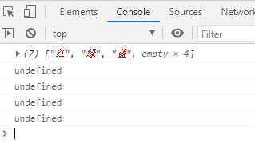

索引号为4、5、6、7的元素没有给值，就是声明变量未赋值，默认为undefined。

实例： [11705add01.html](11705add01.html) 


## 5.2通过修改数组索引新增

```
    let colorArr = ['红', '绿', '蓝'];

    console.log(colorArr); //(7) ["红", "绿", "蓝", empty × 4]
    console.log(colorArr[3]);

    colorArr[3] = '黄';
    colorArr[4] = '青';
    colorArr[5] = '紫';
    colorArr[6] = '橙';
    console.log(colorArr);
    console.log(colorArr[3]);
```

console控制台查看：

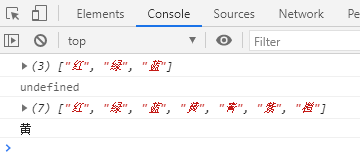

实例：  [11705add02.html](11705add02.html)

**这种方法就是最常见的一种。**


# 6. 简单的数组方法

ECMAScript 数组提供了一种让数组的行为类似于其他数据结构的方法。也就是说，可 以让数组像栈一样，可以限制插入和删除项的数据结构。

## 6.1栈方法Stack

一种数据结构(先出后进)，也就是说最新添加的元素最早被移除。而栈中元素的插入(或叫推入)和移除(或叫弹出)，只发 生在一个位置——栈的顶部。ECMAScript 为数组专门提供了 **push()**和 **pop()**方法。

* push 在末端添加一个元素；
* pop 从末端取出一个元素。

图示：

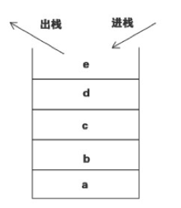


## 6.2队列方法Queue

队列在数组的末端添加元素，从数组的前端移除元素。通过**push()**向数组末端添加一个元素，然后通过**shift()**方法从数组前端移除一个元素。

- push 在末端添加一个元素.
- shift 取出队列首端的一个元素，整个队列往前移，这样原先排第二的元素现在排在了第一。

图示：

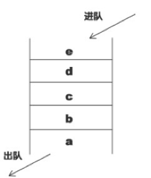

## 6.3作用于末端的方法

* push 在末端添加一个元素：

  ```
      let arrMS = ['Gundam', 'Zaku', 'Baakseng'];
      console.log(arrMS); //Gundam, Zaku, Baakseng
  
      arrMS.push('Apple');
      console.log(arrMS); //Gundam, Zaku, Baakseng, Apple
  ```

  实例： [11706fangfa01push.html](11706fangfa01push.html) 

  **拓展**

  * 调用 `arr.push(...)` 与 `arr[arr.length] = ... ` 是一样的。

* pop 从末端取出一个元素：

  ```
      let arrMS = ['Gundam', 'Zaku', 'Baakseng', 'Gelgoog'];
      console.log(arrMS); //Gundam, Zaku, Baakseng, Gelgoog
  
      console.log(arrMS.pop()); //Gelgoog
      console.log(arrMS);//Gundam, Zaku, Baakseng
  ```

  实例： [11706fangfa02pop.html](11706fangfa02pop.html) 

  

## 6.4作用于首端的方法

* shift 取出数组的第一个元素并返回它：

  ```
      let arrColor = ['红', '黄', '蓝', '绿'];
      console.log(arrColor); //'红', '黄', '蓝', '绿'
  
      console.log(arrColor.shift()); //红
      console.log(arrColor); //'黄', '蓝', '绿'
  ```

  实例： [11706fangfa03shift.html](11706fangfa03shift.html) 

* unshift 在数组的首端添加元素：

  ```
      let arrColor = ['红', '黄', '蓝', '绿'];
      console.log(arrColor); //'红', '黄', '蓝', '绿'
  
      arrColor.unshift('黑');
      console.log(arrColor); //'黑', '红', '黄', '蓝', '绿'
  ```

  

## 6.5同时添加首端和末尾

```
    let arr = [2020];
    arr.unshift(2018, 2019);
    arr.push(2021, 2022);

    console.log(arr); //2018, 2019, 2020, 2021, 2022
```

实例： [11706fangfa05.html](11706fangfa05.html) 


## 6.7更多的方法

先简单讲下一些数组的方法：

1. concat()  方法可以基于当前数组创建一个新数组；

2. slice() 方法可以基于当前数组获取指定区域元素 [start, end)；

3. splice() 方法由于其参数的特殊性，可以完成 增、删、改三个功能

   splice中的删除功能： `var box2 = box.splice(0, 2)`;

   splice中的插入功能： `var box2 = box.splice(1, 0, “钢铁侠”)`;

   splice中的替换功能： `var box2 = box.splice(1, 1, 100)`;

4. join()方法用数组元素组成字符串；

5. reverse() 逆向排序；

6. sort() 从小到大排序，字符串排序


# 7. 多维数组

数组里的项也可以是数组。我们可以将其用于多维数组，例如存储矩阵：

```
    let arr = [
        ['RX78-01', 'RX78-02', 'RX78-03'], //索引0
        ['MS-06A', 'MS-06B', 'MS-06C'],    //索引1
        ['GP01', 'GP02', 'GP03', 'GP04']   //索引2
    ];
    console.log(arr);
    console.log(arr[2][1]); //GP02 在arr里找索引2，然后在索引2的数组里找索引1
```

console控制台：

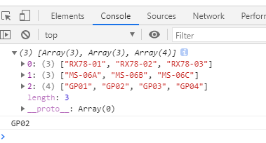

实例： [11707duowei.html](11707duowei.html) 


# 总结

数组是一种特殊的对象，适用于存储和管理有序的数据项。

* 声明

  ```
  let a = new Array(item1, item2...) //极其少见
  
  //以下方法是常见的
  let b = [
  	item1,
  	item2,
  	item3...
  ]
  
  let c = [item1, item2, item3...]
  ```

* 遍历数组的元素

  * `for (let i=0; i<arr.length; i++)` — 运行得最快，可兼容旧版本浏览器。
  * `for (let item of arr)` — 现代语法，只能访问 items。
  * `for (let i in arr)` — 永远不要用这个。

* length

  数组的长度，准确的说是最后一个索引值加一，拥有动态监测性。

* 简单的方法

  `push(...)` 末端添加；

  `pop(...)` 末端移除并返回该元素；

  `shift(...)` 首端移除并返回该元素；

  `unshift(...)` 首端添加。

后面会学习进阶的数组方法，学习更多添加、移除、提取元素和数组排序的方法


# 练习

**1.输出星期六**

定义一个数组，里面存放星期一、星期二。。。星期日（共七天），在控制台输出星期六。

实例： [11799test01.html](11799test01.html) 星期六在索引号为5，用表达式为 `[6 -1]`。

如果实时今天是星期几呢？

实例： [11799test01-01.html](11799test01-01.html) 用Date方法


**2.全部打印出来**

请将  `["关羽","张飞","马超","赵云","黄忠","刘备","姜维"]`; 数组里的元素依次输出到页面上。

实例：

 [11799test02.html](11799test02.html) 一共7个元素，`i < 7`

 [11799test02-01.html](11799test02-01.html) 不用数一共多少个元素直接全部显示出来


**3.求和及平均值**

 求数组 `[2,6,1,7, 4]` 里面所有元素的和以及平均值。

sum 和，avg平均值

实例： [11799test03.html](11799test03.html) 


**4.求最大值**

求数组 `[2,6,1,77,52,25,7]` 中的最大值。

实例： [11799test04.html](11799test04.html) 

来自黑马的答案： [11799test04-01.html](11799test04-01.html) 这个更好，比上一个代码简洁


**5.数组转换为字符串**

要求：将数组 `['GUNDAM', 'ZAKU', 'Baakseng','Gamer']`里面的元素转换为字符串

两个不同输出：

`GUNDAMZAKUBaaksengGamer`

实例： [11799test05-01.html](11799test05-01.html) 

`GUNDAM|ZAKU|Baakseng|Gamer`

实例： [11799test05-02.html](11799test05-02.html) 

黑马的答案： [11799test05-03.html](11799test05-03.html) 这个案例不行，后面末尾有 `|`号


**6.新增元素**

新建一个数组，里面存放10个整数（ 1~10）， 要求使用循环追加的方式输出： `[1,2,3,4,5,6,7,8,9,10]`

实例： [11799test06.html](11799test06.html) 


**7.筛选元素**

要求：将数组 `[2, 0, 6, 1, 77, 0, 52, 0, 25, 7]` 中大于等于 10 的元素选出来，放入新数组。

实例： 

[11799test07.html](11799test07.html) 使用两个自增

 [11799test07-01.html](11799test07-01.html) 使用push()方法

 [11799test07-02.html](11799test07-02.html) 使用length方法


**8.删除指定元素**

将数组 `[2, 0, 6, 1, 77, 0, 52, 0, 25, 7]` 中的 0 去掉后，形成一个不包含 0 的新数组。

实例： [11799test08.html](11799test08.html) 


**9.翻转数组**

将数组 `['GUNDAM', 'ZAKU', 'Baakseng','Gamer']` 的内容反过来存放

输出：`['Gamer', 'Baakseng', 'ZAKU', 'GUNDAM']`

实例：

 [11799test09.html](11799test09.html) 计数器倒序

 [11799test09-01.html](11799test09-01.html) 计数器正序


**10.数组排序（冒泡排序）**

冒泡排序：是一种算法，把一系列的数据按照一定的顺序进行排列显示(从小到大或从大到小）。


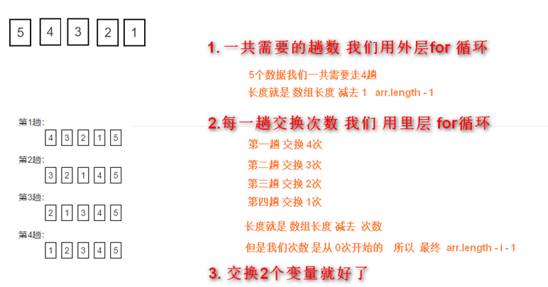

将数组 `[5, 4, 3, 2, 1]` 中的元素按照从小到大的顺序排序，输出： 1，2，3，4，5

首先复习一下如何把2个变量交换数据：

```
// 利用第三个变量
var num1 = 10;
var num2 = 20;
var temp = num1;
num1 = num2;
num2 = temp;
console.log(num1, num2);
```


冒泡实例： [11799test10.html](11799test10.html) 

黑马的答案： [11799test10-01.html](11799test10-01.html) 


***

**以下为现代JavaScript教程的练习**

**11.数组被拷贝了吗?**

下面的代码将会显示什么？

```
let fruits = ["Apples", "Pear", "Orange"];

// 在“副本”里 push 了一个新的值
let shoppingCart = fruits;
shoppingCart.push("Banana");

// fruits 里面是什么？
alert( fruits.length ); // ?
```

实例： [11799test11.html](11799test11.html) 

**解析：**

* 这是因为数组是对象。所以 `shoppingCart` 和 `fruits` 是同一数组的引用。


**12.数组操作**

1. 创建一个数组 `styles`，里面存储有 “Jazz” 和 “Blues”。
2. 将 “Rock-n-Roll” 从数组末端添加进去。
3. 用 “Classics” 替换掉数组最中间的元素。查找数组最中间的元素的代码应该适用于任何奇数长度的数组。
4. 去掉数组的第一个值并显示它。
5. 在数组前面添加 `Rap` 和 `Reggae`。

过程：

```
Jazz, Blues
Jazz, Bues, Rock-n-Roll
Jazz, Classics, Rock-n-Roll
Classics, Rock-n-Roll
Rap, Reggae, Classics, Rock-n-Roll
```

实例： [11799test12.html](11799test12.html) 


**13.数组上下文调用**

```
let arr = ["a", "b"];

arr.push(function() {
  alert( this );
})

arr[2](); // ?
```

结果是什么？为什么？

实例： [11799test13.html](11799test13.html) 有解析


**14.输入数字求和**

写出函数 `sumInput()`，要求如下：

- 使用 `prompt` 向用户索要值，并存在数组中。
- 当用户输入了非数字、空字符串或者点击“取消”按钮的时候，问询结束。
- 计算并返回数组所有项之和。

P.S. `0` 是有效的数字，不要因为是 0 就停止问询。

实例： [11799test14.html](11799test14.html) 

答案： [11799test14-01.html](11799test14-01.html) 


**15.最大的子数组（较难）**

输入是以数字组成的数组，例如 `arr = [1, -2, 3, 4, -9, 6]`.

任务是：找出所有项的和最大的 `arr` 数组的连续子数组。

写出函数 `getMaxSubSum(arr)`，用其找出并返回最大和。

例如：

```
getMaxSubSum([-1, 2, 3, -9]) == 5（高亮项的加和）
getMaxSubSum([2, -1, 2, 3, -9]) == 6
getMaxSubSum([-1, 2, 3, -9, 11]) == 11
getMaxSubSum([-2, -1, 1, 2]) == 3
getMaxSubSum([100, -9, 2, -3, 5]) == 100
getMaxSubSum([1, 2, 3]) == 6（所有项的和）
```

如果所有项都是负数，那就一个项也不取（子数组是空的），所以返回的是 0：

```
getMaxSubSum([-1, -2, -3]) = 0
```

解决方案：https://zh.javascript.info/array#zui-da-zi-shu-zu

慢的解决方法： 

[11799test15-01.html](11799test15-01.html) 

快的解决方法：

 [11799test15-02.html](11799test15-02.html) 


***

**以下为千锋的练习或作业**

**16.冒泡排序**

输入几个数字，然后从小到大排序。输入空字符、空格或点击取消就停止。

实例： [11799test16.html](11799test16.html) 


**17.该数多少位，每位分别是什么**

随机给出一个五位以内的数，然后输出该数共有多少位，每位分别是什么。

实例： [11799test17.html](11799test17.html) 管它多少位照样能输出

答案： [11799test17-01.html](11799test17-01.html) 


**18.输入数字后自动排序**

有一个从小到大排好序的数组。现输入一个数，要求按原来的规律将它插入数组中。

实例： [11799test18.html](11799test18.html) 

连续输入几个数字，非数字或空字符或空格又或取消键停止输入，然后显示原来的数组，再次显示排序好的数组。

实例： [11799test15-02.html](11799test15-02.html) 


**19.map(arr)**

编写函数map(arr) 把数组中的每一位数字都增加30%。

无答案，数组map()参考菜鸟教程

实例： [11799test19.html](11799test19.html) 


**20.has(arr , 60)**

编写函数has(arr , 60) 判断数组中是否存在60这个元素，返回布尔类型。

实例： [11799test20.html](11799test20.html) 

答案： [11799test20-01.html](11799test20-01.html) 


**21.生成13位条形码**

Ean-13 码规则：第十三位数字是前十二位数字经过计算得到的校验码。

例如：690123456789，一共12位

第十三位计算其校验码的过程为：

1. 前十二位的奇数位和6+0+2+4+6+8=26

2. 前十二位的偶数位和9+1+3+5+7+9=34

3. 将奇数和与偶数和的三倍相加26+34*3=128

4. 取结果的个位数：128的个位数为8

5. 用10减去这个个位数10-8=2

所以校验码为2。

**注：**

* 如果取结果的个位数为0，那么校验码不是（10 - 0 =10），而是0。实现方法ean13（）计算验证码，输入12位条码，返回带验证码的条码。

例如：输入：692223361219 输出：6922233612192

实例： [11799test21.html](11799test21.html) 

答案： [11799test21-01.html](11799test21-01.html) 


**22.去重** 

将数组的重复元素去掉，并返回新的数组

实例： [11799test22.html](11799test22.html) 

答案： [11799test22-01.html](11799test22-01.html) 

系统有自带： [11799test22-02.html](11799test22-02.html) 


**23.成绩表**

以下是某班级一次考试的成绩表。请计算总成绩，并按总成绩排名。统计各单科成绩第一名，平均成绩，排序。

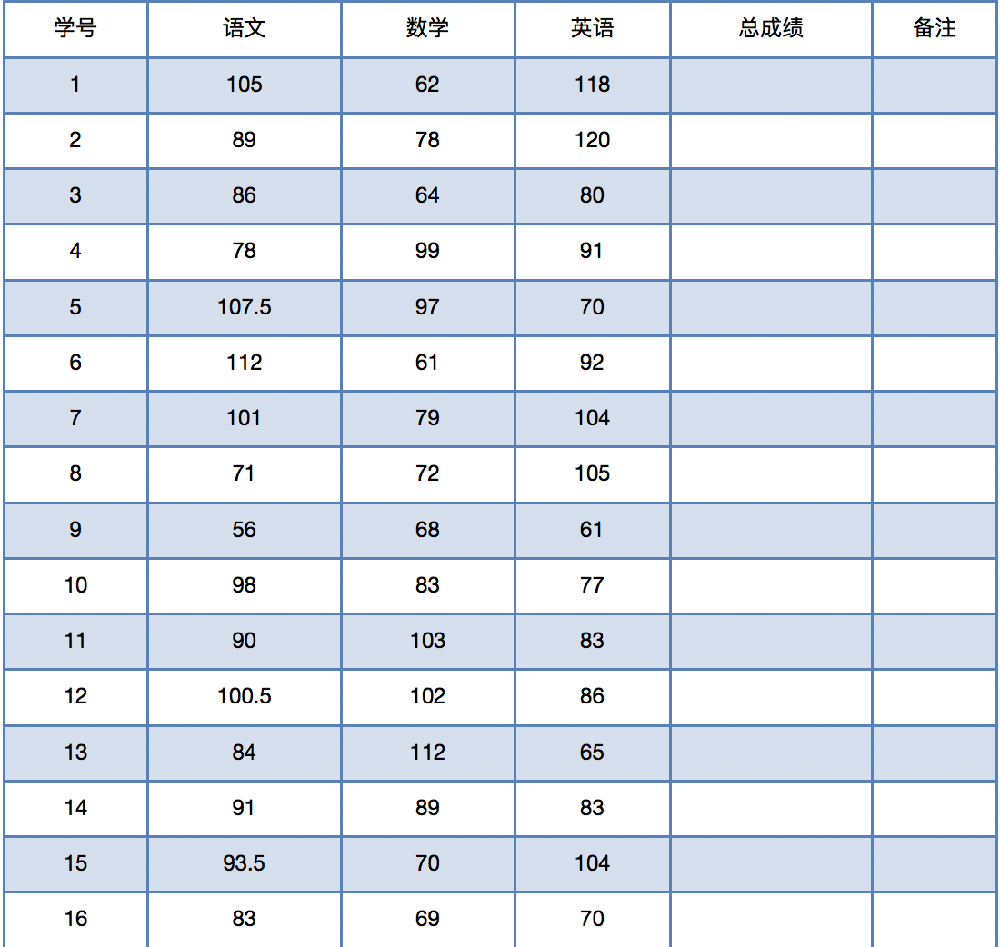

实例： [11799test23.html](11799test23.html) 


**24.简易计算器**

参考： [11799test24简易计算器.html](11799test24简易计算器.html) 

自己虽未做，但是最好深入了解。