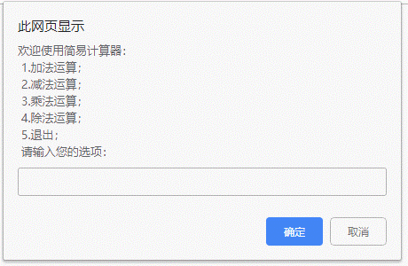

# 117 函数

**目录**


***

# 概要

在 JS 里面，可能会定义非常多的相同代码或者功能相似的代码，这些代码可能需要大量重复使用。

虽然 for循环语句也能实现一些简单的重复操作，但是比较具有局限性，此时可以使用 JS 中的函数function。

函数是由事件驱动的或者当它被调用时执行的可重复使用的代码块。

**意义的总结：**

* 高内聚
* 低耦合
* 复用
* 多态

可以通过函数封装任意多条语句，而且可以在任何地方，任何时候进行调用，使用非常灵活。

简单的示例：

```
    function print(){
        for(let i = 0; i < 10; i++){
            document.write("Hello Baakseng!<br />");
        }
    }
    print();//函数调用
```

输出结果是页面上有10行"Hello Baakseng!"。

实例： [11801function01.html](11801function01.html) 


括号里还能添加参数：

```
    function sum(a, b){
        console.log(a+b);
    }
    sum(5, 10); // 15
    sum(1, 2); // 3
```

实例： [11801function02.html](11801function02.html) 


# 1. 函数的分类

* **内置函数(系统函数、官方函数)**

  是官方提供好的函数，直接使用，例如：

  ```
  alert()
  document.write()
  console.log()
  parseInt() parseFloat()...
  ```

* **自定义函数**

  用户根据实际需求，需要自己封装一个函数。

* **事件驱动函数**

  * 什么是事件驱动函数？

    在和页面交互的过程中所调用的函数，该函数被称之为事件驱动函数。

  * 什么是事件？

    和页面交互的行为称之为事件。比如：鼠标点击某个按钮时(onclick)、鼠标浮动或离开到某个区域时（onmouseenter、onmouseleave）、文本框获取焦点和失去焦点时(onfocus、onblur)等


# 2. 函数定义

也叫函数声明，用function关键字构建一个函数。

使用时分两步：声明函数和调用函数。

语法：

```
function 函数名(参数名1, 参数名2, ...) //函数也可以没有形参
{
	语句/代码块;
	return 返回值; // 也可以没有返回值(undefined)
}
函数名();
```

花括号为函数体，当调用该函数时，会执行函数内的代码。

**==注意==**

* 函数不调用，自己不执行！


**==建议：==**

* 见名思意，函数名必须体现其功能。

```
    function twoNumSum(a, b){
        console.log(a + b);
    }
    twoNumSum(5, 3); //8
```

函数名twoNumSum的直观意思就是两个数之和。

实例： [11802shengming.html](11802shengming.html) 


多次调用：

```
    function print(){
        for(let i = 0; i < 10; i++){
            document.write("Hi, Baakseng! <br />");
        }
    }
    print();
    print();
    print();
```

结果为输出30行"Hi, Baakseng!"，因为调整用三次 `print()`，所以3次10行就是一共3行。

实例：  [11802shengming01.html](11802shengming01.html) 


被调用的函数括号里可以设参数：

```
    function print(j){
        for(let i = 0; i < j; i++){
            document.write("Hi, Baakseng! <br />");
        }
    }
    print(1); // 1行
    print(5); // 5行
    print(3); // 3行
```

实例： [11802shengming02.html](11802shengming02.html) 


**构建函数的好处：**

* 使程序变得简短而清晰
* 有利于程序维护
* 可以提高程序开发效率
* 提高了代码的重用性（复用性）


# 3. 参数

在调用函数时，可以向其传递值，这些值被称为参数，也称函数参数。

* **形参**就是在声明函数时，函数名后面的参数，不能用var或let修饰。

* **实参**就是调用时，函数名后面的参数

```
function f(a, b){ // a和b是形参
	// 语句/代码
}
f(5, 2); // 5和2是实参
```

参数的作用：在函数内部某些值不能固定，我们可以通过参数在调用函数时传递不同的值进去。

使用参数的示例：

```
    function sum(a, b){
        console.log(a + b);
    }
    sum(3, 5); //15
    sum(55, 2); //57
```

实例：  [11803canshu.html](11803canshu.html) 


两个参数使用字符串示例：

```
    function MSG(personal, text){
        document.write(personal + ": " + text + "<br />");
    }
    MSG("卡尔玛", "夏亚，你算计我");  //卡尔玛: 夏亚，你算计我
    MSG("夏亚", "啊哈哈！");        //夏亚: 啊哈哈！
    MSG();                        //undefined: undefined
    MSG("Baakseng");              //Baakseng: undefined
    // MSG( , "Hi"); 出错
    MSG("Baakseng", "");          //Baakseng:
```

当函数被调用时，给定值被复制到了局部变量personal和text。然后函数使用它们进行计算。

实例：   [11803canshu01.html](11803canshu01.html) 

**==根据上面的示例代码==**

* 形参和实参个数匹配的问题

  | 情况                 | 说明                               |
  | -------------------- | ---------------------------------- |
  | 实参个数等于形参个数 | 输出正确的结果                     |
  | 实参个数多于形参个数 | 只能取形参的个数，多余的实参被忽略 |
  | 实参个数少于形参个数 | 多的形参定义为undefined            |

  ```
      // 测试用
      function sum(a, b) {
          if (arguments.length === 2) {
              console.log("第1个参数和第二个参数的和是:" + a + b);
          } else if (arguments.length === 1) {
              console.log("block,只传了一个参数 " + a + "，让我如何相加")
          } else {
              console.log("我拒绝运算！")
          }
      }
      sum(10, 8);//第1个参数和第二个参数的和是:108
      sum(10);//block,只传了一个参数 10，让我如何相加
      sum();//我拒绝运算！
  ```
  
  实例： [11803canshu01-01.html](11803canshu01-01.html) 


**==注意==**

* 在一般传值调用的机制中只能把实参传送给形参，而不能把形参的值反向地传送给实参。因此在函数调用过程中，形参值发生改变，而实参中的值不会变化。

  例：

  ```
      function addNum(n) {
          n += 5;
          console.log(n); 
      }
      
      var a = 10;
  
      addNum(a); //15
      console.log(a); //10 
  ```

  实例：   [11803canshu02.html](11803canshu02.html) 

  

  还有一个例子，一个变量 from，并将它传递给函数。请注意：函数会修改 from，但在函数外部看不到更改，因为函数修改的是复制的变量值副本：

  ```
      function showMSG(from, text) {
          from = "| " + from + " |";
          document.write(from + " : " + text + "<br />"); 
      }
  
      let from = "Gundam";
  
      showMSG(from, "Hello"); //| Gundam | : Hello
      // Gundam 变成 | Gundam |
      
    document.write(from); //Gundam
  ```
  
  实例：  [11803canshu03.html](11803canshu03.html) 


# 4. 默认值

如果未提供参数，那么其默认值则是 undefined。

示例：

```
    function msg(personal, text){
        document.write(personal + " : " + text + "<br />");
    }
    msg("Baakseng" , "I am the Gundam"); //Baakseng : I am the Gundam 两个参数
    msg("zaku" ,); //zaku : undefined
    msg();//undefined : undefined
    // msg(, "123"); 错误 Uncaught SyntaxError: Unexpected token ','
```

实例：  [11804morenzhi.html](11804morenzhi.html) 

这不是错误，没有参数，程序会假定text === undefined。但是没有第一个参数（就是 , 号前面的参数）会出错。


设定参数默认，可以用 = 号指定：

```
    function msg(personal, text = "ahhh"){
        document.write(personal + " : " + text + "<br />");
    }

    msg("Gundam"); //Gundam : ahhh
    msg("zaku", "2333"); //zaku 2333
```

实例：  [11804morenzhi01.html](11804morenzhi01.html) 

如果text未被传递，它将会得到值"ahhh"。

text也可以是更复杂的表达式，并且只会在缺少参数时才会被计算和分配。所以，这也是可能的：

```
function msg(personal, text = anotherFunction()) {
  // anotherFunction() 仅在没有给定 text 时执行
  // 其运行结果将成为 text 的值
}
```

**==注意==**

* 在 JavaScript 中，每次函数在没带个别参数的情况下被调用，默认参数会被计算出来。
* 在上面的例子中，每次 msg() 不带 text 参数被调用时，anotherFunction() 就会被调用。


**后备的默认参数**

有些时候，将参数默认值的设置放在函数执行（相较更后期）而不是函数声明的时候，也能行得通。

为了判断参数是否被省略掉，可以拿它跟 undefined 做比较：

```
    function msg(personal, text){
        if(text === undefined){
            text = "...";
        }
        document.write(personal + " : " + text + "<br / >");
    }
    msg("Baakseng", "Hi"); //Baakseng : Hi
    msg("The man", "fuck off"); //The man : fuck off
    msg("Baakseng"); //Baakseng : ...
```

实例： [11804morenzhi02.html](11804morenzhi02.html) 

text未被传递，则得到字符串的值"..."。


或者可以使用`||`运算符：

```
    function msg(personal, text){
        text = text || "...";
        document.write(personal + " : " + text + "<br / >");
    }
    msg("Baakseng", "Hi"); //Baakseng : Hi
    msg("The man", "fuck off"); //The man : fuck off
    msg("Baakseng"); //Baakseng : ...
```

实例：   [11804morenzhi03.html](11804morenzhi03.html) 


现代 JavaScript 引擎支持 空值合并运算符 `??`，当可能遇到其他假值时它更有优势，如 0 会被视为正常值不被合并：

```
    function showCount(count){
        console.log(count ?? "unknow");
    }
    showCount(0); //0
    showCount(); //unknow
    showCount(null); //unknows
```

实例：  [11804morenzhi04.html](11804morenzhi04.html) 


# 5. 返回值

有时，我们会希望函数将值返回调用它的地方，通过使用 return 语句就可以实现。

在使用 return 语句时，函数会停止执行，并返回指定的值。

简单的例子，将两个数相加的函数：

```
    function sum(a, b){
        return a + b;
    }
    let result = sum(1, 5);
    console.log(result); //6
    console.log(sum(2, 7)); //9
```

实例：  [11805fanhuizhi.html](11805fanhuizhi.html) 

**==注意==**

* 函数的返回值只能通过return来返回,除了return以外，没有任何声明可以表示返回值。


**==注意==**

* return会终止函数

  无论return在哪里，只要有执行了return同一条的代码后，函数立即停止，并且立即退出，因此位于return语句之后的任何代码都永远不会执行：

  ```
      function sum(a, b){
          return a + b;
          //取消上一行试试看
          console.log("测试代码"); // 这行代码没被执行
      }
      document.write(sum(2, 5));//7
  ```

  实例： [11805fanhuizhi01.html](11805fanhuizhi01.html) 


**可多次出现：**

在一个函数中可能会出现很多次 `return`。例如：

```
<script>
    function checkAge(age){
        if(age >= 18){
            return true;
        }else {
            return false;
        }
    }

    let age = prompt("多大啦你？", 18);

    if(checkAge(age)){
        alert("同意访问");
    }else {
        alert("禁止访问");
    }
</script>
```

18岁以上（含18岁）同意访问，否则禁止访问。

实例：   [11805fanhuizhi02.html](11805fanhuizhi02.html) 


只使用 return 但没有返回值也是可行的。但这会导致函数立即退出。例如：

```
<script>
    let age = prompt("请输入你的年龄", 18);
    function showMSG(age){
        if(!age){ //试试去掉!号
            return;
        }
        alert("abcd")
    }
    showMSG();
</script>
```

在上述代码中，if(!age) 返回 false，那么 showMSG 将不会运行到 alert。

无论return在哪里，只要有执行了return同一条的代码后，函数立即停止，并且立即退出，因此位于return语句之后的任何代码都永远不会执行。

实例： [11805fanhuizhi03.html](11805fanhuizhi03.html) 


**==注意==**

* 空值的 return 或没有 return 的函数返回值为 undefined。示例：

  ```
      function showNull(){    }
      console.log(typeof showNull()); //undefined
      console.log(typeof showNull); //function
      console.log(showNull() === undefined); //true
  ```
  
  实例：  [11805fanhuizhi04.html](11805fanhuizhi04.html) 

* 空值的 return 和 return undefined 等效。

* return只能返回一个值。如果用逗号隔开多个值，则以最后一个为准。示例：

  ```
      function result(a, b){
          return a * b, a + b;
      }
      let fanhuizhi = result(10, 15);
      document.write(fanhuizhi); //25
  ```
  
  实例：   [11805fanhuizhi05.html](11805fanhuizhi05.html) 


**break, continue, return的区别**

|          | 作用                                                         |
| -------- | ------------------------------------------------------------ |
| break    | 结束当前的循环体（如 for、while）                            |
| continue | 跳出本次循环，继续执行下次循环（如 for、while）              |
| return   | 不仅可以退出循环，还能够返回 return 语句中的值，同时还可以结束当前的函数体内的代码 |


**==WARING==**

* 不要在 return 与返回值之间添加新行

  对于 return 的长表达式，可能你会很想将其放在单独一行，如下所示：

  ```
  return
   (some + long + expression + or + whatever * f(a) + f(b))
  ```

  但这不行，因为 JavaScript 默认会在 return 之后加上分号。上面这段代码和下面这段代码运行流程相同：

  ```
  return;
   (some + long + expression + or + whatever * f(a) + f(b))
  ```

  实际上它变成了空值。

  解决方法：

  ```
  return (
    some + long + expression
    + or +
    whatever * f(a) + f(b)
    )
  ```

  这样能正常运行。

**总结**

* 任何一个函数都有return关键字，用来导出函数内部的值；（闭包的思路）；
* return是非必须的，可以写也可以不写；如果不写，或者return后面没有值，函数的返回结果都是undefined；
* 无论return写在哪里，只要函数执行到了return这条代码了，执行完以后，立即停止执行并且跳出函数；会导致return下面的代码将不会执行；
* 推荐的做法是要么让函数始终都返回一个值，要么永远不要返回值，；否则函数有时候有返回值，有时候没有返回值，调试起来不方便。


# 6. arguments

**arguments** 作用是存储传递过来的所有实参。

是当前函数的一个**内置对象**。所有函数都内置了一个arguments对象。

arguments是一个**伪数组**（并非数组），因此可以进行遍历，具有几个特点：

* length属性
* 按索引方式储存数据
* 不具有数组的方法（push, pop等等）


获取实参示例：

```
    function test(){
        console.log(arguments);
    }
    test(1, 2, 3, 4); // [1, 2, 3, 4]
    test("GUMDAM", "ZAKU"); // [GUMDAM, ZAKU]
```

实例： [11806arguments.html](11806arguments.html) 


具有length属性：

```
    function test(){
        console.log(arguments);
        console.log(arguments.length);
    }
    test("A", "B", "C"); 
    // ["A", "B", "C"]
    // 3
```

传递时获取实参长度：3个。

实例： [11806arguments01.html](11806arguments01.html) 


能根据索引值获取：

```
    function fn(){
        console.log(arguments[2]);
    }
    fn(33, 66, 99, 77, 11);
    // 99
```

99处于索引号为2的位置。

虽然能用索引，但并非数组。

实例： [11806arguments02.html](11806arguments02.html) 


**==注意==**

* 仅能在函数体里使用：

  ```
      function fn(){
          console.log(arguments);
      }
      fn(33, 66, 99, 77, 11); //[33, 66, 99, 77, 11]
      
      console.log(arguments); //Uncaught ReferenceError: arguments is not defined
  ```

  实例： [11806arguments03.html](11806arguments03.html) 


# 7. 函数嵌套

因为每个函数都是独立的代码块，用于完成特殊任务，因此经常会用到函数相互调用的情况。

```
    function fn1(){
        console.log("Hi,");
        fn2();
    }

    function fn2(){
        console.log("Baakseng!");
    }

    fn1();
    // Hi,
    // Baakseng

    fn2(); // Baakseng
```

实例： [11807qiantao.html](11807qiantao.html) 


# 8. 函数递归

当一个函数解决一个任务时，在解决的过程中它可以调用很多其它函数。在部分情况下，函数会调用 **自身**。这就是所谓的 **递归**。

说白了，函数自己调用自己时，称为递归调用。

例子，写一个函数 `pow(x, n)`，它可以计算 x 的 n 次方。换句话说就是，x 乘以自身 n 次方：

```
pow(2, 2) = 4
pow(2, 3) = 8
pow(2, 4) = 16
```

* 迭代思路：使用for循环

  ```
      function powNum(x, n){
          let jieguo = 1;
          for(let i = 0; i < n; i++){
              jieguo *= x
          }
          return jieguo;
      }
      console.log(powNum(2, 2)); //4
      console.log(powNum(3, 3)); //27
      console.log(powNum(2, 5)); //32
  ```

  实例： [11808digui01.html](11808digui01.html) 

* 递归思路：简化任务，调用自身

  ```
      function powNum(x, n){
          if(n === 1){
              return x;
          }else {
              return x * powNum(x, n-1);
          }
      }
      console.log(powNum(2, 2)); //4
      console.log(powNum(3, 3)); //27
      console.log(powNum(2, 5)); //32
  ```

  实例： [11808digui02.html](11808digui02.html) 

  

递归是一种编程模式，在一个任务可以自然地拆分成多个相同类型但更简单的任务的情况下非常有用。或者，在一个任务可以简化为一个简单的行为加上该任务的一个更简单的变体的时候可以使用。或者，就像我们很快会看到的那样，处理某些数据结构。

具体的可查现代JavaScript教程：https://zh.javascript.info/recursion#comments


**千锋教育教程的递归：**

**重要性：**

* 递归的分量，递归属于函数中比较难理解的知识，在应用开发中，虽然使用不是很频繁，但是很体现你的功底，而且，从事**IT**行业开发，最好要会递归，如果说现在可以不要求灵活运用的话，以后到公司中一定要会，如果面试中有人问你递归，说明，他对你要求挺高。（内存管理机制）
* 有些公司明文禁止使用递归。

**特点：**

* 函数自己调用自己；
* 一般情况有参数；
* 一般情况下有return。

**==注意==**

* 函数的递归调用只能用于静态的数据运算，如果是动态数据，风险过高，容易崩溃；
* 凡是循环能做到的，递归都能做到；
* 有一些循环不容易解决的事情，递归能轻松解决；
* 递归可以写出来，但是不知道认为是对的。


示例：计算1+2+3+…+100的和

```
    // 方法
    // 1. 首先去找临界值，即无需计算，获得的值，比如1
    // 2. 找这一次和上一次的关系
    // 3. 假设当前函数已经可以使用，调用自身计算上一次
    // sum(100) = sum(99) + 100
    // sum(n) = sum(n-1) + n
    function sum(n){
        if(n == 1){
            return 1;
        }
        return sum(n-1) + n;
    }
    console.log(sum(100));
```

实例： [11899test24-02.html](11899test24-02.html) 


# 9. 函数命名

函数就是行为（action）。所以它们的名字通常是动词。它应该简短且尽可能准确地描述函数的作用。这样读代码的人就能清楚地知道这个函数的功能。

例如，以 "show" 开头的函数通常会显示某些内容。

函数以 XX 开始……

* "get…" —— 返回一个值，
* "calc…" —— 计算某些内容，
* "create…" —— 创建某些内容，
* "check…" —— 检查某些内容并返回 boolean 值，等。

**总之，命名是一门学问！**


# 练习

**1.求M~N之间的累加和**

例如1到100之间的累加和，或者50到100之间的累加和。

实例： [11899test01.html](11899test01.html) 


**2.求和**

利用函数求任意三个数的和。

实例： [11899test02.html](11899test02.html) 

连续输入三个数，并用alert()输出总和： [11899test02-01.html](11899test02-01.html) 


**3.求两个数的最大值**

利用函数返回值的方法求任意两个数的最大值。

实例： [11899test03.html](11899test03.html) 

用 `?`号运算符： [11899test03-01.html](11899test03-01.html) 


**4.数组中的最大值**

求数组 [5,2,99,101,67,77] 中的最大数值。

实例： [11899test04.html](11899test04.html) 

黑马的答案： [11899test04-01.html](11899test04-01.html) 


**5.加减乘除运算** 

两个数之间的加减乘除运算，并将结果返回。

实例： [11899test05.html](11899test05.html) 


**6.简单的计算器小功能**

写一个函数，用户输入任意两个数字的任意算术运算（简单的计算器小功能），并能弹出运算后的结果。

实例： [11899test06.html](11899test06.html) 


**7.返回最大值**

写一个函数，用户输入任意两个数字的最大值，并能出弹运算后的结果。

实例： [11899test07-01.html](11899test07-01.html) 

写一个函数，用户输入任意三个不同数字的最大值，并能弹出运算后的结果。

实例： [11899test07-02.html](11899test07-02.html) 


**8.判断是否素数（质数）**

写一个函数，用户输入一个数判断是否是素数，并返弹出回值（又叫质数，只能被1和自身整数的数）。

实例： [11899test08.html](11899test08.html) 

输入数字n，然后返回所有从2到n的质数： [11899test08-01.html](11899test08-01.html) 


**9.用arguments求最大值**

利用函数求任意个数的最大值。

实例： [11899test09.html](11899test09.html) 


**10.冒泡排序**

利用函数封装方式进行冒泡排序。

实例： [11899test10.html](11899test10.html) 


**11.用函数判断闰年**

输入一个年份，判断是否是闰年（闰年：能被4整除并且不能被100整数，或者能被400整除）。

实例： [11899test11.html](11899test11.html) 

黑马的答案： [11899test11-01.html](11899test11-01.html) 


**12.2月份的天数**

用户输入年份，输出当前年份2月份的天数。

函数可以调用另一个函数。[7. 函数嵌套](#7-函数嵌套)

实例： [11899test12.html](11899test12.html) 

黑马答案： [11899test12-01.html](11899test12-01.html) 


**13.翻转数组**

利用函数封装方式，翻转任意一个数组。

实例： [11899test13.html](11899test13.html) 

直接用reverse()方法： [11899test13-01.html](11899test13-01.html) 

黑马的答案： [11899test13-02.html](11899test13-02.html) 


**14.数字数组的排序**

写一个函数，实现对数字数组的排序。

实例： [11899test14.html](11899test14.html) 


**15.简易计算器**



实例： [11899test15.html](11899test15.html) 


***

**以下为现代JavaScript教程的练习**

**16.是否需要 “else”？**

如果参数 age 大于 18，那么下面的函数将返回 true。

否则它将会要求进行确认，并返回确认结果：

```
function checkAge(age) {
  if (age > 18) {
    return true;
  } else {
    // ...
    return confirm('Did parents allow you?');
  }
}
```

实例： [11899test16-01.html](11899test16-01.html) 

如果 else 被删除，函数的工作方式会不同吗？

```
function checkAge(age) {
  if (age > 18) {
    return true;
  }
  // ...
  return confirm('Did parents allow you?');
}
```

实例： [11899test16-02.html](11899test16-02.html) 

这两个变体的行为是否有区别？

答案：没有区别。


**17.使用 '?' 或者 '||' 重写函数**

如果参数 age 大于 18，那么下面的函数返回 true。

否则它将会要求进行确认，并返回确认结果：

```
function checkAge(age) {
  if (age > 18) {
    return true;
  } else {
    return confirm('Do you have your parents permission to access this page?');
  }
}
```

原始代码示例： [11899test17.html](11899test17.html) 

重写这个函数并保证效果相同，不使用 if，且只需一行代码。

编写 checkAge 的两个变体：

* 使用问号运算符 `?`

  实例： [11899test17-01.html](11899test17-01.html) 

* 使用或运算符 `||`

  实例： [11899test17-02.html](11899test17-02.html) 


**18.函数 min(a, b)**

写一个返回数字 a 和 b 中较小的那个数字的函数 min(a,b)。

例如：

```
min(2, 5) == 2
min(3, -1) == -1
min(1, 1) == 1
```

实例： [11899test18.html](11899test18.html) 

现代JS的答案：

*  [11899test18-01.html](11899test18-01.html) 
*  [11899test18-02.html](11899test18-02.html) 


**19.函数 pow(x,n)**

写一个函数 `pow(x,n)`，返回 `x` 的 `n` 次方。换句话说，将 `x` 与自身相乘 `n` 次，返回最终结果。

```
pow(3, 2) = 3 * 3 = 9
pow(3, 3) = 3 * 3 * 3 = 27
pow(1, 100) = 1 * 1 * ...*1 = 1
```

创建一个 web 页面，提示输入 x 和 n，然后返回 pow(x,n) 的运算结果。

P.S. 在这个任务中，函数应该只支持自然数 n：从 1 开始的整数。

实例： [11899test19.html](11899test19.html) 

现代JS的答案： [11899test19-01.html](11899test19-01.html) 


***

**以下为千锋的练习和作业**

**20.和、差、积、商**

计算两个数字的和、差、积、商

要求：使用传参的形式

实例： [11899test20.html](11899test20.html) 

千锋的答案： [11899test20-01.html](11899test20-01.html) 


**21.顺序输出**

编写一个函数，计算三个数字的大小，按从小到大顺序输出。

实例： [11899test21.html](11899test21.html) 

分别输入三个数字： [11899test21-01.html](11899test21-01.html) 

输入n个数值，空格或非数字或取消键停止输入数字，然后从小到大排序显示出来： [11899test21-02.html](11899test21-02.html) 


**22.输入奇偶n，分母不同** 

输入n为偶数时，调用函数求1/2+1/4+...+1/n,当输入n为奇数时，调用函数求1/1+1/3+...+1/n。

实例： [11899test22.html](11899test22.html) 


**23.求最大的数**

利用函数求任意两个数的最大值。

实例： [11899test23-01.html](11899test23-01.html) 

求任意三个数的最大值。

实例： [11899test07-02.html](11899test07-02.html) 


**24计算1+2+3+…+100的和**

用循环： [11899test24-01.html](11899test24-01.html) 

用递归： [11899test24-02.html](11899test24-02.html) 


**25.显示n行hello world。**

输入一个n,打印n个hello world的运行结果，再写出这次的运行结果。

用循环： [11899test25-01.html](11899test25-01.html) 

用递归： [11899test25-02.html](11899test25-02.html) 

千锋的答案： [11899test25-03.html](11899test25-03.html)  这个数序是倒序的


**26.菲波那切数列（拓展训练，较难）**

兔子繁殖问题，设有一对新生兔子，从第四个月开始他们每个月月初都生一对兔子，新生的兔子从第四个月月初开始又每个月生一对兔子。
按此规律，并假定兔子没有死亡,n(n <= 20)个月月末共有多少对兔子？

答案： [11899test26.html](11899test26.html) 

千锋的答案：


**27.n个参数相乘的**

写个函数计算所有传入参数相乘的。

实例： [11899test27.html](11899test27.html) 


**28.7的倍数**

找出0-100之间7的倍数，和包含7的数，封装函数。

实例： [11899test28.html](11899test28.html) 


**29.返回值是所有数的乘积**

用递归实现1-n内的所有数的乘积，n传入的参数，返回值是所有数的乘积。

实例： [11899test29.html](11899test29.html) 


**30.桃子原来有多少只**

有一堆桃子不知数目，猴子第一天吃掉一半，觉得不过瘾，又多吃了一只，第二天照此办法，吃掉剩下桃子的一半另加一只，天天如此，到第num(num <= 10)天早上，猴子发现只剩一只桃子了，问这堆桃子原来有多少只？ 

思路：n为还剩n天吃完的桃子数。

实例： [11899test30.html](11899test30.html) 

千锋的答案： [11899test30-01.html](11899test30-01.html) 


**31.输出密文**

某个公司采用公用电话传递数据，数据是四位的整数，在传递过程中是加密的，加密规则如下：每位数字都加上5,然后用除以10的余数代替该数字，再将第一位和第四位交换，第二位和第三位交换，请编写一个函数，传入原文，输出密文。

实例： [11899test31.html](11899test31.html) 

千锋的答案： [11899test31-01.html](11899test31-01.html) 

如果把密文返回到原始数据：  [11899test31-02.html](11899test31-02.html) 