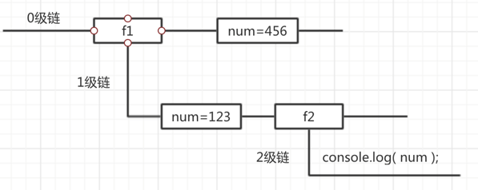

# 119 作用域

**目录**
- [119 作用域](#119-作用域)
- [概要](#概要)
- [1. 全局作用域](#1-全局作用域)
- [2. 局部作用域](#2-局部作用域)
- [3. 块级作用域](#3-块级作用域)
  - [3.1 let 和 var的区别](#31-let-和-var的区别)
  - [3.2 循环作用域的区别](#32-循环作用域的区别)
  - [3.3 全局作用域](#33-全局作用域)
  - [3.4 局部作用域](#34-局部作用域)
- [4. 自动全局](#4-自动全局)
- [5. 全局和局部的区别](#5-全局和局部的区别)
- [6. 作用域链](#6-作用域链)
- [总结](#总结)
- [练习](#练习)


***

# 概要

**作用域**指一个变量的作用范围。它是静态的(相对于上下文对象)，在编写代码时就确定了。也是**可访问变量**，**对象**和**函数**的集合。

作用：隔离变量，不同作用域下同名变量不会有冲突。

Javascript中的作用域现有三种：

* 全局作用域
* 局部作用域（函数作用域）
* 块级作用域（ES6新引入的）


# 1. 全局作用域

**全局**（在函数之外）声明的变量拥有**全局作用域**。

就是作用于所有代码执行的环境（整个 script 标签内部）或者一个独立的 js 文件。

示例：

```
        var MyName = "Baakseng";
        function showName(){
            document.write("函数内部的变量" + MyName);
            // 此处代码可以使用变量 MyName
        }
        showName();
        document.write("全局的变量" + MyName);
        // 此处代码也可以使用变量 MyName
```

实例：  [11901quanju.html](11901quanju.html) 

**全局变量**的作用域是**全局的**，网页的所有脚本和函数都能够访问它。


# 2. 局部作用域

也叫函数作用域。

变量在函数内声明，此变量拥有**局部作用域（函数作用域）**。

示例：

```
    function fn(){
        var MyName = 'Baakseng';
        // 局部作用域
    }
    console.log(MyName); 
    // 此处代码不能用 MyName
    
    // 输出结果：
    // Uncaught ReferenceError: MyName is not defined
```

实例： [11902jubu.html](11902jubu.html) 

**局部变量**的作用域是**局部的**，只能在函数内部访问它们。

还有，函数的**参数**实际上就是局部变量。


**好处：**

* 由于只能在函数内部识别局部变量，因此能够在不同函数中使用同名变量。


# 3. 块级作用域

ES6（也叫ES2015）引入了两个重要的新关键词 `let` 和 `const`，这俩关键词能提供块级作用域**Block Scope**变量和常量，ES5以前是没有块级作用域的。


## 3.1 let 和 var的区别

通过 var 声明的变量是没有**块作用域**。

在块 { } 内声明的变量可以从块之外进行访问：

```
{ 
  var x = 10; 
}
// 此处可以使用 x
```

示例：

```
    function fn(){
        var MS_Name = "GUMDAN";
            if(true){
                var MS_Name = "ZAKU";
            }
        console.log(MS_Name);
    }
    fn(); // ZAKU
```

实例： [11903kuai01.html](11903kuai01.html) 


在块 { } 内声明的变量无法从块外访问：

```
{ 
  let x = 10;
}
// 此处不可以使用 x
```

使用 let 关键字重新声明变量：

```
    function fn(){
        let MS_Name = "GUMDAN";
            if(true){
                let MS_Name = "ZAKU";
            }
        console.log(MS_Name);
    }
    fn(); // GUMDAM
```

实例： [11903kuai02.html](11903kuai02.html) 

**==注意==**

* 在块中重新声明不会重新声明块外的变量。


## 3.2 循环作用域的区别

使用 var 处理循环：

```
    var i = 7; 
    for(var i = 0; i < 10; i++){
        
    }
    
    console.log(i); //10
```

实例： [11903kuai03.html](11903kuai03.html) 

使用 var 重新声明了循环之外的变量。


使用 let 处理循环：

```
    let i = 7; 
    for(let i = 0; i < 10; i++){
        
    }
    
    console.log(i); //7
```

实例： [11903kuai04.html](11903kuai04.html) 

使用 let 不能声明循环之外的变量。

由此可见，循环括号里也是代码块。


## 3.3 let全局变量

如果在全局中声明，那么 let 和 var 作用一样。

它们都拥有全局作用域。

```
var a = 10; // 全局作用域
let b = 1; // 全局作用域
```


## 3.4 let局部变量

在函数作用域内，var 和 let作用范围还是一样，但是如果在函数内还有一个**代码块**，这个代码块里分别用 let 和 var声明变量，是有区别的：

在代码块内用 var 声明：

```
    function fn(){
        var num = 1;
        {
            var num = 2;
        }
        console.log(num);
    }
    fn();// 2
```

实例： [11903kuai05.html](11903kuai05.html) 


在代码块内用 let 声明：

```
    function fn(){
        let num = 1;
        {
            let num = 2;
        }
        console.log(num);
    }
    fn();// 1
```

实例： [11903kuai06.html](11903kuai06.html) 


由此可见，let 和 var 最主要的**区别**：

* var 声明整个函数封闭里的变量；
* let 声明一个代码块里的变量，圆括号 ( )，花括号{ }也是代码块。


# 4. 自动全局

如果您为尚**未声明的变量**赋值，此变量会自动成为**全局变量**。

```
        function fn(){
            myName = 'Baakseng';
        }
        fn();
        console.log(myName);
        // 此代码处可以使用myName变量
```

实例： [11904zidong.html](11904zidong.html) 


如果在上面示例的函数里声明了变量：

```
    function fn() {
        var myName = 'Baakseng';
    }
    fn();
    console.log(myName);
    // Uncaught ReferenceError: myName is not defined
```

实例： [11904zidong01.html](11904zidong01.html) 

所以，未声明的变量被赋值，会自动成为**全局变量**。在函数内部**有声明的变量**就是**局部变量**。


**==注意==**

* 在**“严格模式”**中，是不会自动创建全局变量。


# 5. 全局和局部的区别

区别在于变量的有效期：

* **全局变量**

  在 HTML 中，全局作用域是 window。所有全局变量均属于 window 对象。

  就是在任何一个地方都可以使用，只有在浏览器关闭时才会被删除，因此比较占内存。

* **局部变量**

  只在函数内部使用，当其所在的代码块被执行时，会被初始化；当代码块运行结束后，就会被删除，因此更节省内存空间。

  但是有个别情况，如果**这个作用域**中的内存**被外部占用**，那么**这个作用域**暂时不能被删除。


# 6. 作用域链

如果函数中还有函数，那么在这个作用域中就又可以诞生一个作用域，根据在**内部函数**可以访问**外部函数**变量的这种**机制**，用链式查找决定哪些数据能被内部函数访问，就称作**作用域链**。

示例：

```
    function f1(){
        var num = 123;
        function f2(){
            console.log(num);
        }
        f2();
    }
    var num = 456;
    f1(); //123
```

分析：



方法：采取就近原则的方式来查找变量最终的值。

实例： [11906zuoyongyulian.html](11906zuoyongyulian.html) 


# 总结

此次学习作用域一章，只是先简单的了解，日后会深入的学习，还有闭包这一类。

建议学习的传送门：

* https://zh.javascript.info/closure#tasks
* https://www.axihe.com/anbang/js/es-scope/02.html


# 练习

**1.结果是几**

```
    var a = 1;
    function fn1() {
        var a = 2;
        var b = '22';
        fn2();
        function fn2() {
            var a = 3;
            fn3();
            function fn3() {
                var a = 4;
                console.log(a); //a的值 ?
                console.log(b); //b的值 ?
            }
        }
    }
    fn1();
```

实例： [11999test01.html](11999test01.html) 内有输出结果


***

以下为现代JavaScript的练习

**2.使用哪个值？**

```
let name = "John";

function sayHi() {
  alert("Hi, " + name);
}

name = "Pete";

sayHi(); // 会显示什么："John" 还是 "Pete"？
```

这种情况在浏览器和服务器端开发中都很常见。一个函数可能被计划在创建之后一段时间后才执行，例如在用户行为或网络请求之后。

因此，问题是：它会接收最新的修改吗？

实例： [11999test02.html](11999test02.html) 


**3.哪些变量可用？**

下面的 makeWorker 函数创建了另一个函数并返回该函数。可以在其他地方调用这个新函数。

它是否可以从它被创建的位置或调用位置（或两者）访问外部变量？

```
function makeWorker() {
  let name = "Pete";

  return function() {
    alert(name);
  };
}

let name = "John";

// create a function
let work = makeWorker();

// call it
work(); // 会显示什么？
```

实例： [11999test03.html](11999test03.html) 

解析：https://zh.javascript.info/closure#na-xie-bian-liang-ke-yong-ni


**4.Counter 是独立的吗？**

在这儿我们用相同的 makeCounter 函数创建了两个计数器（counters）：counter 和 counter2。

它们是独立的吗？第二个 counter 会显示什么？0,1 或 2,3 还是其他？

```
function makeCounter() {
  let count = 0;

  return function() {
    return count++;
  };
}

let counter = makeCounter();
let counter2 = makeCounter();

alert( counter() ); // 0
alert( counter() ); // 1

alert( counter2() ); // ?
alert( counter2() ); // ?
```

实例： [11999test04.html](11999test04.html) 


