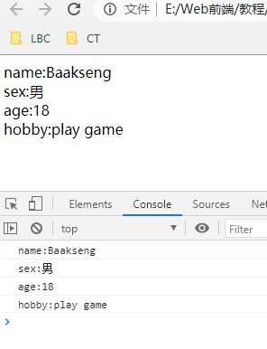

# 201 对象

**目录**
- [201 对象](#201-对象)
- [概要](#概要)
- [1. 什么是对象](#1-什么是对象)
- [2. 创建方式](#2-创建方式)
  - [2.1 new 操作符和Object 构造函数](#21-new-操作符和object-构造函数)
  - [2.2 对象字面量](#22-对象字面量)
  - [2.3 属性名和属性值](#23-属性名和属性值)
  - [2.4 创建方法（添加函数）](#24-创建方法添加函数)
  - [2.5 使用构造函数创建](#25-使用构造函数创建)
  - [2.6 创建对象与构造函数的区别](#26-创建对象与构造函数的区别)
- [3.调用（访问）](#3调用访问)
  - [3.1 访问对象属性](#31-访问对象属性)
  - [3.2 调用对象方法](#32-调用对象方法)
- [4. 遍历对象属性](#4-遍历对象属性)
- [总结](#总结)
- [练习](#练习)


***

# 概要

现实生活中，**万物皆对象**。对象是一个具体的事物，看得见摸得着的实物，比如：一台高达、一台扎古、一个驾驶员，都可以是“对象”，还有虚拟的东西也可以是对象，比如：一把屠龙刀、三相之力、游戏等等。还有一个数据库、一张网页、一个与远程服务器的连接（接口）也可以是“对象”。

对象有它自己的属性，例如下面一把屠龙刀的属性：

* 物理攻击：999
* 魔法攻击：0
* 重量：99KG
* 效果：对龙种族伤害增加999%，有1%概率秒杀。
* 职业：战士、法师（没错，劳资是近战法师）


**拓展**

* 引用类型的值（对象）是**引用类型**的一个实例。在 EMCAScript 中，**引用类型**是一种数据结构，用于将数据和功能组织在一起。它也常被称为**类**，但是这称呼不妥当。虽然从技术上讲 JavaScript 是一门面向对象的语言，但它缺少**传统的面向对象编程语言**所具备的**类**和**接口**等**基本结构**。引用类型有时候也被称为**对象定义**，因为它能描述自己应有的属性和方法。
* 虽然**引用类型**和**类**有点像，但它们并不是相同的概念。

# 1. 什么是对象

前面111数据类型里有提到Object对象，是一种**引用类型**，也是**复杂数据类型**。number、string、boolean...是**原始数据类型**。

在 JavaScript中，对象是一组无序的相关属性和方法的集合，所有事物都是对象，例如字符串、数值、数组、函数等。


对象是由**属性**和**方法**组成的：

* 属性：事物的特征，在对象中用属性来表示（常用名词）。
* 方法：事物的行为，在对象中用方法来表示（常用动词）。

```
        let phone = {
            brand : "Apple",
            name : "iPhone 7",
            color : "silver",
            function : "玩游戏、砸核桃"
        };
        console.log(phone);
```

实例：   [20101object01.html](20101object01.html) 


我们看到的大多数引用类型值都是Object类型的实例，而且Object也是JS中最多的一个数据类型，Object类型的数据是储存和传输数据的最佳选择。

例如，把我的个人信息保存在数组中：

```
    let person = ['Baakseng', '男', 18, '近战法师'];
    console.log(person);
    // ["Baakseng", "男", 18, "近战法师"]
```

实例： [20101object02.html](20101object02.html) 

如果用对象方式来保存：

```
    let person = {};
    person.name = 'Baakseng',
    person.sex = '男',
    person.age = 18,
    person.job = '近战法师';

    console.log(person);
    // {name: "Baakseng", sex: "男", age: 18, job: "近战法师"}
    console.log(person.name);
    // Baakseng
    console.log(typeof person);
    // object 类型为object
```

看上去结构更清晰，更强大。

实例：   [20101object03.html](20101object03.html) 


# 2. 创建方式

创建 Object 的方式有两种：

## 2.1 new 操作符和Object 构造函数

使用 new 操作符和 Object 构造函数，和前面学的 new Array() 原理一致。

如下面的示例：

```
    let MS = new Object();
    // 对象名.key = value;
    MS.name = 'GUMDAM';
    MS.Num = 'RX-78';
    MS.height = 18;
    MS.weight = 50;

    console.log(MS);
    // {name: "GUMDAM", Num: "RX-78", height: 18, weight: 50}
```

实例：   [20102chuangjian01.html](20102chuangjian01.html) 

还有下面的创建方式：

```
let MS = {}; // 这种创建也可行
let MS = Object(); // 省略 new 也可以的
```


## 2.2 对象字面量

用**对象字面量**创建。

对象字面量是对象定义的一种简写形式，目的在于简化创建包含大量属性的对象的过程。

```
    let MS = {
    	// key : value
        name : 'GUMDAM',
        Num : 'RX-78',
        height : 18,
        weicht : 50,
    }
    console.log(MS);
    // {name: "GUMDAM", Num: "RX-78", height: 18, weicht: 50}
```

注意键（属性名）之间要加逗号，最后一个属性名后面不用添加逗号

实例：  [20102chuangjian02.html](20102chuangjian02.html) 


**==建议==**

* 使用哪种方法创建对象Object都可以，但是开发者更倾向于使用对象字面量语法。因为这种对象字面量语法要求的代码量少，而且能够给人封装数据的感觉。实际上，对象字面量也是向函数传递大量可选参数的首选方式。


## 2.3 属性名和属性值

属性名也叫**键**，属性值可以简称**值**。

上面的两种示例中的name

```
MS.name = 'GUMDAM'
name : 'GUMDAM'
```

等号或冒号左边是键，也叫属性名
等号或冒号右边是值，也是属性值，可以是任意类型的值，甚至是函数function（注意一定要加括号）。


## 2.4 创建方法（添加函数）

给对象创建方法（就是在对象里面添加函数）：

```
    let Obj1 = {
        showName : function (){
            alert("Baakseng"); 
        }
    }
    Obj1.showName(); //// 一定要加括号
```

实例：  [20102chuangjian03.html](20102chuangjian03.html) 


## 2.5 使用构造函数创建

还有一种创建方式，就是利用构造函数创建对象，用到 this 关键词（后面会学到 this 内容）：

```
    function person(name, age, sex){
        this.name = name;
        this.age = age;
        this.sex = sex;
        this.sayHi = function(){
            alert('我的名字叫：' + this.name + '，' + this.age + '岁' + '，' + this.sex);
        }
    }
    let Baakseng = new person('Baakseng', 18, '男');
    let GUNDAM = new person('GUNDAM', 18, '男');
    console.log(Baakseng.name); // Baakseng
    Baakseng.sayHi(); // 我的名字叫：Baakseng，18岁，男
    console.log(GUNDAM.sex); // 男
```

实例： [20102chuangjian04.html](20102chuangjian04.html) 


**new 关键词执行过程：**

1. 在内存中创建一个新的空对象；
2. 让 this 指向这个新的对象；
3. 执行构造函数里面的代码，给这个新对象添加属性和方法；
4. 返回这个新对象（所以构造函数不需要return）。


## 2.6 创建对象与构造函数的区别

* 创建对象，如 new Car()，特指某一个，通过 new 关键字创建对象的过程我们也称为对象实例化 。
* 构造函数，如 Car()，抽象了对象的公共部分，封装到了函数里面。泛指一大类

图例：


```
// 对象是一个具体的事物
let car = {
	name = '五菱神车',
	weight = 1.2,
	color = 'white'
}
console.log(car);

// 构造函数 汽车 泛指的一大类 它类似于JAVA
function car(name, weight, color){
	this.name = name;
	this.weight;
	this.color;
}
let wulingshenche = new car('五菱神车', 1.2, color);
console.log(wulingshengche);
```


# 3.调用（访问）

## 3.1 访问对象属性

调用对象的属性有两种方式：

* 对象.属性名

  ```
      let person = {
          name : 'Baakseng',
          age : 18,
          hobby : 'play game'
      }
  
      console.log(person.name); // Baakseng
      console.log(person.hobby); // play game
  ```

  实例： [20103diaoyong01.html](20103diaoyong01.html) 

* 对象['属性名']，方括号里必须加**引号**，单引号或双引号都可。

  ```
      let person = {
          name : 'Baakseng',
          age : 18,
          hobby : 'play game'
      }
  
      console.log(person["name"]); // Baakseng
      console.log(person['age']); // play game
      console.log(person[hobby]); // Uncaught ReferenceError: hobby is not defined
  ```

  没添加引号会报错。

  实例： [20103diaoyong02.html](20103diaoyong02.html) 

* 区别

  从功能上看，这两种访问对象属性的方法没有任何区别。方括号语法的主要优点是可以**通过变量来访问属性**。

  ```
      let person = {
          name : 'Baakseng',
          age : 18,
          hobby : 'play game'
      }
  
      console.log(person["name"]); // Baakseng
  
      let a = "name";
      console.log(person[a]); // Baakseng
  ```

  实例： [20103diaoyong03.html](20103diaoyong03.html) 

  

## 3.2 调用对象方法

对象.方法名()，注意这个方法名后面要加括号。

```
    let person = {
        name : 'Baakseng',
        age : 18,
        disability : 'deaf',
        myAlert : function (){
            alert('I am deaf');
        }
    }
    person.myAlert(); // I am deaf

    person.myAlert; // 不添加括号啥都没反应

    console.log(person.myAlert); // 控制台显示的是函数 function 的内容

    console.log(person.myAlert()); // I am deaf 会弹出警告框的
```

实例： [20103diaoyong04.html](20103diaoyong04.html) 


# 4. 遍历对象属性

for...in 语句用于对数组或者对象的属性进行循环操作。

语法：

```
for (变量 in 对象名字){
	// 执行代码
}
```

示例：

```
    let person = {
        name : 'Baakseng',
        sex : '男',
        age : 18,
        hobby : 'play game'
    }

    let x;
    let msg = '';
    
    for(x in person){
    // for(let x in person) 也可行
        console.log(x); // 得到的是对象属性名
        console.log(person[x]); // 得到的是对象属性值
    }
```

运行结果：


实例： [20104forin01.html](20104forin01.html) 


如果想要一行来显示属性名：属性值，示例如下：

```
    for(x in person){
        console.log(x + ':' + person[x]); // 显示在控制台上
        document.write(x + ":" + person[x] + "<br />"); // 显示在页面上
    }
```

运行结果：



实例： [20104forin02.html](20104forin02.html) 


# 总结

* 对象是存储各种不同数据类型的集合，有属性名和属性值，存放结构看上去清晰。

* 创建方式：

  new Object()，省略new也可行，或者直接赋值{}都可以

  字面量

  构造函数

* 调用

  对象名.属性名

  对象名["属性名"]，单双引号都可以，方括号里面的可以是有声明的变量。
  
* 遍历对象

  for(变量x in 对象名)

  变量x 获取对象的属性名；

  对象名[变量x] 获取对象的属性值。

此次学习的201 对象只是普通的对象，后面会学到各种对象的操作（删除属性、检查属性、遍历对象等）、内置对象（Array、Date、Error）等等。


# 练习

**1.狗子**

请用对象字面量的形式创建一个名字为可可的狗对象，具体信息如下：

* 姓名：可可
* 类型（type）：阿拉斯加犬
* 年龄：5岁
* 颜色：棕红色
* 技能：汪汪汪（break），演电影（showFilm）

实例： [20199test01.html](20199test01.html) 


**2.那个黄头发的人**

请用new Object 形式创建一个鸣人的对象，具体信息如下：

* 姓名：鸣人
* 性别：男
* 年龄：19岁
* 技能：影分身之术

实例： [20199test02.html](20199test02.html) 


**3.坦克和射手**

利用构造函数创建两个英雄对象。函数中的公共部分包括：姓名属性(name)，类型属性（type），血量属性（blood）和攻击方式（attack）。

英雄对象信息如下：

* 廉颇 坦克型 500血量 近战
* 后羿 射手型 10血量 远程

实例： [20199test03.html](20199test03.html) 