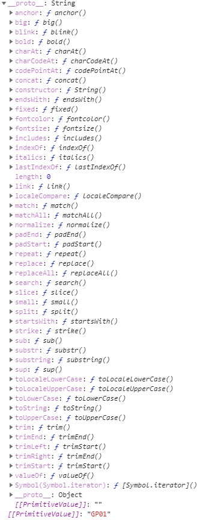
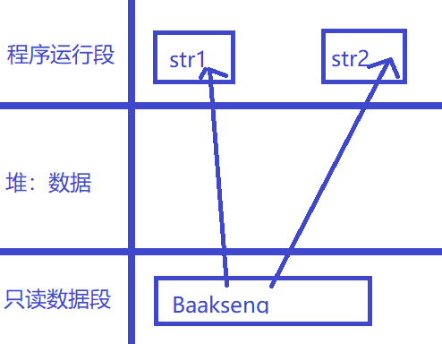
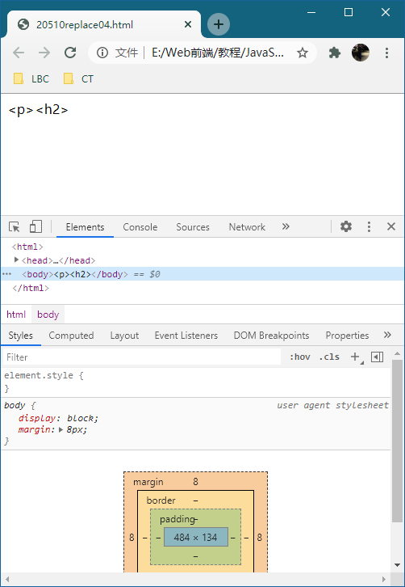
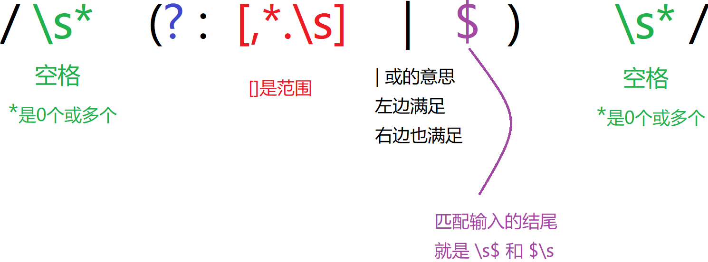
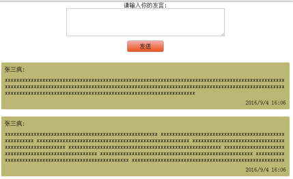

# 205 字符串

**目录**
- [205 字符串](#205-字符串)
- [1. 认识字符串对象](#1-认识字符串对象)
- [2. 创建](#2-创建)
- [3. length](#3-length)
- [4. 字符串的不可变](#4-字符串的不可变)
- [5. 可遍历字符串](#5-可遍历字符串)
- [6. 获取字符](#6-获取字符)
  - [6.1 charAt(index)](#61-charatindex)
  - [6.2 charCodeAt(index)](#62-charcodeatindex)
  - [6.3 string[index]](#63-stringindex)
  - [6.4 fromCodeChar(index)](#64-fromcodecharindex)
  - [6.5 超出范围](#65-超出范围)
- [7. 位置方法](#7-位置方法)
  - [7.1 indexOf()](#71-indexof)
  - [7.2 lastIndexOf()](#72-lastindexof)
  - [7.3 search()](#73-search)
  - [7.4 indexOf 与 search 区别](#74-indexof-与-search-区别)
- [8. concat() 拼接](#8-concat-拼接)
- [9. 截取方法](#9-截取方法)
  - [9.1 substr()](#91-substr)
  - [9.2 slice()](#92-slice)
  - [9.3 substring()](#93-substring)
  - [9.4 三个方法的区别总结](#94-三个方法的区别总结)
- [10. replace() 替换](#10-replace-替换)
  - [10.1 newstr 替换 oldstr](#101-newstr-替换-oldstr)
  - [10.2 RegExp 替换](#102-regexp-替换)
  - [10.3 $ 特殊变量名](#103--特殊变量名)
  - [10.4 function 替换](#104-function-替换)
- [11.split() 分割](#11split-分割)
  - [11.1 split('string')](#111-splitstring)
  - [11.2 split(RegExp)](#112-splitregexp)
- [12. 转换大小写](#12-转换大小写)
- [13. 特殊字符和反引号](#13-特殊字符和反引号)
- [总结](#总结)
- [练习](#练习)
***

# 1. 认识字符串对象

前面有一个内容 <a href="..\111 Javascript数据类型\111 Javascript数据类型.md">111 Javascript数据类型</a> 提到的一种数据类型—— string 字符串，所有带单引号或双引号的叫做字符串。这是基本类型。

为方便操作基本数据类型，JavaScript 还提供了三个特殊的引用类型：String、Number 和 Boolean。这些的类型叫做**基本包装类型。**

**==注意==**

* 开头大写的 String、 Number 和 Boolean 是复杂数据类型；
* 开头小写的是简单数据类型。

字符串是基本类型，按照逻辑上不应该有方法， 但是 JavaScript 可以使之有方法，所以**万物皆可对象**。

示例：

```
    let myName = 'Baakseng';
    let text = myName.indexOf('k');
    console.log(myName, text); // Baakseng 3
    // Baakseng 中的 k 索引号为3
    console.log(typeof myName); // string
```

实例： [20501renshi01.html](20501renshi01.html) 

实际上，每当读取一个基本类型值的时候，**后台就会创建一个对应的基本包装类型的对象**，从而让我们能够调用一些方法来操作这些数据。

根据上面的示例执行过程如下：

```
    let myName;
    // 生成临时变量
    let tmp = new String('Baakseng');
    // 赋值给我们的字符串
    myName = tmp;
    // 销毁临时变量
    tmp = null;
    console.log(myName); // 输出结果在下面所示
    console.log(typeof myName); // object
    console.log(tmp); // null
    console.log(typeof tmp); // object
```

console.log(myName); 的输出结果：

```
String {"Baakseng"}
0: "B"
1: "a"
2: "a"
3: "k"
4: "s"
5: "e"
6: "n"
7: "g"
length: 8
__proto__: String
[[PrimitiveValue]]: "Baakseng"
```

实例： [20501renshi02.html](20501renshi02.html) 

数字第0位是"B"，第1位是"a"，它的 length 属性是8，即8个字符。它的默认值是 "Baakseng"，它的原型 (proto) 是 String 这个类。前面有个一段话：**JS中的万物皆可对象**，字符串型 string 是字符串引用类型 String 中的一员，是会继承字符串引用类型的所有属性。好比人属于人类中的一员，人会继承人类的所有特征一样。

点击 "proto" 原型，可查看它继承 String 哪些方法，下图所示可展示全部方法：



```
    let myName = new String('Baakseng');
    console.log(myName.__proto__); // String
    console.log(myName.__proto__.__proto__); // Object
    console.log(myName.__proto__.__proto__.__proto__); // null
```

这个方法的原型，指向了 Function 的 prototype （注意constructor这个属性,默认会指向Function本身），再次打开proto，会打开继承的Object这个基本引用类型；之所以说是基本引用类型，是因为Object.proto是null，已经到顶了。

我们从里面选一个方法 indexOf()，看看这个方法用途是什么：

```
    let test1 = myName.indexOf('B');
    let test2 = myName.__proto__.indexOf('B');
    console.log(test1); // 0
    console.log(test2); // -1
```

indexOf() 这个方法就是括号里的字符在哪个索引号。'B' 在第0位，所以输出是0。

实例： [20501renshi03.html](20501renshi03.html) 

如果使用下面就不行了，会报错，因为 .proto.proto里面并没有 indexOf() 这个方法。

```
let test3 = myName.__proto__.__proto__.indexOf('B'); // is not a function 
```

基本包装类型的简单讲解就到这一步，后面会单独一个内容做笔记了解基本包装类型。


# 2. 创建

字符串的创建有以下几个方法：

* 通过 new 运算符创建字符串；
* 省略 new 创建字符串；
* 字符串字面量赋值。 

```
    let str1 = new String('GP01');
    let str2 = String('GP02');
    let str3 = 'GP03';

    console.log(str1, typeof str1); // String {"GP01"} object
    console.log(str2, typeof str2); // GP02 string
    console.log(str3, typeof str3); // GP03 string
```

实例： [20502shengming01.html](20502shengming01.html) 

当 String() 和 new 运算符一起作为构造函数使用时，它返回一个新创建的String对象,存放的是字符串s或s的字符串表示。
当不用new运算符调用String()是，它只把s转换成原始的字符串，并返回转换后的值。


字符串的执行图解：

```
    let str1 = 'Baakseng';
    let str2 = str1;
    console.log(str1, str2); // Baakseng Baakseng
```



字符串被创建时会放进 只读的数据段，当用 str1 赋值给 str2 时，'Baakseng' 会从只读段赋值给 str2。

实例： [20502shengming02.html](20502shengming02.html) 


# 3. length

每个 String 对象都有 length 属性，表示字符串中的字符数量。看下面的示例：

```
    let str = new String('Baakseng');
    let howLength = str.length;
    console.log(str.length); // 8
    console.log(howLength); // 8
```

有8个字符。

实例： [20503length01.html](20503length01.html) 


如果是汉字呢？

```
    let myName = '黎柏成';
    console.log(myName.length); // 3 
```

一个汉字算一个字符。

实例： [20503length02.html](20503length02.html) 


其它各种汉英、空格、标点符号、空字符等等示例：

```
    let str1 = '中文english';
    console.log(str1.length); // 9 一个汉字一个字符
    
    let str2 = 'hi!,.';
    console.log(str2.length); // 一个标点符号一个字符

    let str3 = ' '; // 一个空格
    let str4 = '  '; // 两个空格
    console.log(str3.length, str4.length); // 1 2 一个空格一个字符

    let str5 = '';
    console.log(str5.length); // 0 无内容就是零个字符

    let str6 = 'Hi! L叔。，';
    console.log(str6.length); // 8 一个中文标点符号一个字符
```

实例： [20503length03.html](20503length03.html) 

**==注==**

* 中文：utf-8（三个字符表示一个汉字），gbk（两个字符表示一个汉字）。


# 4. 字符串的不可变

在 JavaScript 中，字符串是只读的，意味着字符串一旦创建就不能被修改。

看下面示例：

```
    let str = 'abc';
    console.log(str[0]); // a
    // 尝试修改 str 的内容
    str[0] = 'd';
    console.log(str[0]); // a
```

无法更改字符串内容。

实例： [20504zhidu01.html](20504zhidu01.html) 

如果重新给变量 str 赋值新的字符串呢？

```
    let str = 'abc';
    console.log(str, str[0]); // abc a

    str = 'def';
    console.log(str, str[0]); // def d
```

虽然变量 str 能被重新赋值新的字符串，但是 常量 'abc' 依然在内存中。

实例： [20504zhidu02.html](20504zhidu02.html) 

重新给字符串赋值，会重新在内存中开辟空间，这个特点就是字符串的不可变。由于这个特点，在大量拼接字符串的时候会有效率问题。

```
    let start = Date.now();
    let str = '';
    for(let i = 0; i < 100000; i++){
        str += i;
    }
    console.log(str);
    let end = Date.now();
    console.log(end - start); // 24毫秒
```

实例： [20504zhidu03.html](20504zhidu03.html) 


# 5. 可遍历字符串

可通过循环进行遍历字符串。

示例：

```
    let str = '不动明王阵';
    for(let i = 0; i < str.length; i++){
        document.write(str[i] + '<br />');
    }
    // 不
	// 动
	// 明
	// 王
	// 阵
```

实例： [20505bianli01.html](20505bianli01.html) 

输出第 偶数 位的字符串：

```
    let str = '霜之哀伤火之高兴';
    for(let i = 0; i < str.length; i += 2){
        document.write(str[i]);
    }
    // 霜哀火高
```

实例： [20505bianli02.html](20505bianli02.html) 


# 6. 获取字符

有个方法可以根据位置获取字符串中的字符。

| 方法                    | 功能                                                         |
| ----------------------- | ------------------------------------------------------------ |
| charAt(索引值)          | 返回指定索引位置的字符                                       |
| charCodeAt(索引值)      | 返回指定索引位置字符的 UTF-16 单元表示的 Unicode 值          |
| str[索引值]             | str 为声明字符串的变量，返回指定索引位置的字符，与 charAt() 等效 |
| fromCharCode(Unicode值) | 返回由指定的 UTF-16 代码单元序列创建的字符串。               |

* 有个教程说的 charCodeAt() 返回的是 ASCII 码。可我查 MDN 和 W3School 提的是 Unicode 码。先不管，后面再了解了解。


## 6.1 charAt(index)

返回指定位置的字符，index 参数为字符中的下标（索引值），若括号里无参数，则默认为0。

示例：

```
    let myName = 'Baakseng';
    let s1 = myName.charAt(0);

    console.log(s1); // B B在索引值1的位置
    console.log(myName.charAt(2)); // a a在索引值2的位置
    console.log(myName.charAt(1, 3)); // a 参数只能1个，以最左为准
    console.log(myName.charAt()); // B 括号内无参数，则默认0
```

实例： [20506huoqu01.html](20506huoqu01.html) 


## 6.2 charCodeAt(index)

返回指定位置的字符的 Unicode 编码，括号里的参数作用和上面一样。

示例：

```
    let myName = 'Baakseng';
    console.log(myName.charCodeAt(0)); // 66 B的 Unicode 值为66
    console.log(myName.charCodeAt(1)); // 97 a的 Unicode 值为97

    console.log(myName.charCodeAt(1, 3)); // 97 只能获取括号内最左边的

    console.log(myName.charCodeAt()); // 66 括号内无参数，默认0索引的字符的 U 编码
```

实例： [20506huoqu02.html](20506huoqu02.html) 


## 6.3 string[index]

string 为声明字符串的变量，返回指定索引位置的字符，与 charAt() 等效。

示例：

```
    let myName = 'Baakseng';
    console.log(myName[0]); // B
    console.log(myName[0, 1]); // a 只能获取最右边的

    // console.log(myName[]); 
    // Uncaught SyntaxError: Unexpected token ']' 
    // [] 内无参数，则出错 不能空的
```

实例： [20506huoqu03.html](20506huoqu03.html) 


## 6.4 fromCodeChar(index)

返回由指定的 UTF-16 代码单元序列创建的字符串，index 参数为 Unicode 编码，参数可多个。

示例：

```
    let myName = String.fromCharCode(66, 97, 97, 107, 115, 101, 110, 103);
    console.log(myName); // Baakseng
    console.log(typeof myName); // string
```

实例： [20506huoqu04.html](20506huoqu04.html) 

**==注意==**

* fromCodeChar() 其实是一个创建字符串的方法，和 charAt() 不一样的。

网上有 Unicode 编码表 可参考，也有在线转换工具使用。


## 6.5 超出范围

比如，能显示 Baakseng 的索引值范围为 0 到 7，如果索引为 8 会输出什么样的？

```
    let myName = 'Baakseng';
    console.log(myName[8]); // undefined
    console.log(myName[100]); // undefined
    console.log(myName.charAt(8)); //  空字符
    console.log(myName.charCodeAt(8)); // NaN
```

实例：  [20506huoqu05.html](20506huoqu05.html) 

索引值为负数：

```
    let myName = 'Baakseng';
    console.log(myName[-1]); // undefined
    console.log(myName.charAt(-1)); //  空字符
    console.log(myName.charCodeAt(-1)); // NaN
```

情况和上面的超出范围示例一样。

实例： [20506huoqu03.html](20506huoqu03.html) 


超出范围情况总结：

* 不使用方法，myName[超出范围]，输出为 undefined。
* charAt() 索引值超出范围，返回空字符串。
* charCodeAt() 索引值超出范围，返回 NaN。


# 7. 位置方法

根据字符返回其所在字符串中首次出现的索引号。


## 7.1 indexOf()

格式：

```
indexOf(searchValue, fromIndex);
```

searchValue 即要查找的字符，fromIndex 从哪个索引号开始（可选的）

示例：

```
    let person = 'Baakseng';
    let weizhi = person.indexOf('k', 0);
    console.log(weizhi); // 3 k 在索引号3的位置
    console.log(person.indexOf('e')); // 5 无位置的参数，即默认从0开始

    let str1 = 'abcdabcd';

    console.log(str1.indexOf('a', 0)); // 0
    // a在索引号0的位置，只能显示首次出现的

    console.log(str1.indexOf('a', 2)); // 4 
    // 从索引号2开始寻找字符 a 的位置，首次出现在4的位置
```

实例： [20507weizhi01.html](20507weizhi01.html) 


如果没有找到会返回什么：

```
    let str1 = 'abc';
    console.log(str1.indexOf('d', 0)); // -1
    // 没有找到返回 -1
```

实例： [20507weizhi02.html](20507weizhi02.html) 


 fromIndex 大于 length 的情况：

```
    let str = 'abcdef'; // length为6
    console.log(str.indexOf('a', 7)); // -1
```

返回 -1。

实例： [20507weizhi03.html](20507weizhi03.html) 


fromIndex 为负数：

```
    let str = 'abcdef';
    console.log(str.indexOf('b', -5)); // 1
    console.log(str.indexOf('b', -50)); // 1
```

字符 b 在索引值2的位置，返回2。

实例： [20507weizhi04.html](20507weizhi04.html) 


**==注意==**

* 查找字符对大小写敏感的，比如字符串 'abcdef'，用 indexOf('A', 0) 是找不到的（返回值 -1）。


indexOf(声明的变量，fromIndex)：

```
    let str1 = 'abcdefg';
    let str2 = 'abc';
    let str3 = 'cd';
    let str4 = 'abd';
    console.log(str1.indexOf(str2, 0)); // 0
    console.log(str1.indexOf(str3, 0)); // 2
    console.log(str1.indexOf(str4, 0)); // -1
```

searchValue 可以是其它字符串的变量。

实例： [20507weizhi05.html](20507weizhi05.html) 


## 7.2 lastIndexOf()

返回最后一个被发现的给定值的索引值，如果没有找到则返回 -1。

格式：

```
lastIndexOf(searchValue [, fromIndex]);
```

和上面 indexOf() 的 fromIndex 有区别的：

* indexOf() 的 fromIndex 是从左向右查找；
* lastIndexOf() 的 fromIndex 是从右向左查找。

一个参数的示例：

```
    let str = 'abcabcabc';
    console.log(str.lastIndexOf('a')); // 6
    // 出现 a 字符的索引值分别是0， 3， 6
    // lastIndexOf() 方法就是匹配最后一个的
```

实例： [20507weizhi06.html](20507weizhi06.html) 


从不同的开始位置查找：

```
    let str = 'abcabcabc'; // 索引号 0~8
    console.log(str.lastIndexOf('c', 0)); // -1
    console.log(str.lastIndexOf('c', 1)); // -1
    console.log(str.lastIndexOf('c', 2)); // 2
    // 讲解：
    // 第一行 从索引值0往左查找，找不到 c 则返回 -1
    // 第二行 从索引值1往左查找，找不到 c 则返回 -1
    // 第二行 从索引值2往左查找，找到 c 则返回 2

    console.log(str.lastIndexOf('c', 6)); // 5
    console.log(str.lastIndexOf('c', str.length)); // 8
    console.log(str.lastIndexOf('c', 10)); // 8
```

fromIndex 大于等于 length 就是查找整个字符串。

实例： [20507weizhi07.html](20507weizhi07.html) 


负数：

```
    let str = 'abcabcabc';
    console.log(str.lastIndexOf('c', -1));
    console.log(str.lastIndexOf('c', -5));
    console.log(str.lastIndexOf('c', 0));

    console.log(str.lastIndexOf('a', 0));
    console.log(str.lastIndexOf('a', -1));
    console.log(str.lastIndexOf('a', -5));
```

结论就是当 fromIndex 小于 0 时（即负数），等同于 fromIndex == 0。

实例： [20507weizhi08.html](20507weizhi08.html) 


## 7.3 search()

用于检索字符串中指定的子字符串，或检索与**正则表达式**相匹配的子字符串。（后面会学到 RegExp 对象）

格式：search(regexp)。

找到则返回第一个匹配的位置，没找到则返回 -1。

示例：

```
    let str = 'abcabcabc';
    let s1 = 'abc';
    let s2 = 'cab';
    console.log(str.search(s1)); // 0
    console.log(str.search(s2)); // 2
    console.log(str.search('bcab')); // 1
```

实例： [20507weizhi09.html](20507weizhi09.html) 


修饰符：i 忽略大小写， g 全局匹配。

```
    let str = 'Abcabcabc';
    let s1 = /abc/;
    let s2 = /abc/i;
    let s3 = /abc/g;
    console.log(str.search(s1)); // 3
    console.log(str.search(s2)); // 0
    console.log(str.search(s3)); // 3
```

实例： [20507weizhi10.html](20507weizhi10.html) 


## 7.4 indexOf 与 search 区别

两种方法，indexOf() 与 search()，搜索姿势是相等的。
但是这两种方法是不相等的。区别在于：

* search() 方法无法设置第二个开始位置参数；
* indexOf() 方法无法设置更强大的搜索值（正则表达式）。

后面会学习到正则表达式这些更强大的检索值。


# 8. concat() 拼接

拼接方法，这个方法用于将**原字符串**和 一个或多个字符串按顺序连接，然后返回合并的新字符串。

但是**原字符串**并没有被修改。

语法：

```
str.concat(str2, [, ...strN])
```

示例：

```
    let s1 = 'hello ';
    let s2 = 'world!';
    let s3 = s1.concat(s2); 
    
    console.log(s3); // hello world!
    console.log(s1.concat('Baakseng!')); // hello Baakseng!
    
    console.log(s1.concat(s1)); // hello hello 原字符串和原字符串拼接
    console.log(s1.concat()); // hello 无参数
    console.log(s1.concat(s1, s1, s1)); 
    // hello hello hello hello 多个参数

    console.log(s1); // hello 看看 s1 有没有被改动
```

结论，原字符串没有被修改。

实例：  [20508pinjie01.html](20508pinjie01.html) 


如果参数是非字符串的数据类型，拼接前会被转换为字符串型：

```
    let str = 'abc';
    let strnum = '123';
    let num = 123;
    let bool = true;
    let un = undefined;
    let NULL = null;
    
    console.log(str.concat(num)); // abc123
    console.log(strnum.concat(num)); // 123

    console.log(typeof bool); // boolean
    console.log(str.concat(bool)); // abctrue

    console.log(typeof un); // undefined
    console.log(str.concat(un)); // abcundefined

    console.log(typeof NULL); // object 
    // 虽然显示是obj 但正确是null JS的致命失误
    console.log(str.concat(NULL)); // abcnull

    // 管它什么数据类型，用 concat 方法拼接前通通转成字符串
```

实例：  [20508pinjie02.html](20508pinjie02.html) 


**性能**

* MDN 强烈建议使用赋值运算符 `+`、`+=` 代替 concat() 方法。

```
    let s1 = 'a';
    let s2 = 'bc';
    console.log(s1 + s2); // abc
    console.log(s1.concat(s2)); // abc
    // 等效 + 运算符比较简便
```

实例： [20508pinjie03.html](20508pinjie03.html) 


# 9. 截取方法

EMCAScript 提供了从字符串中提取（截取）其子字符串的方法有三个：

* substr(start, [length])

  从 start 位置（索引号）开始，根据 length 数量截取子字符串。

* substring(start, [end])

  从 start 位置（索引号）开始，到 end （索引号）截取子字符串，但不截取 end 位置的字符。

* slice(start, [end])

  从 start 位置（索引号）开始，到 end （索引号）截取子字符串，但不截取 end 位置的字符。

**共性：**

* 这三个方法第一个参数（即 start）作用都一样，都是起始位置；
* 返回值都子字符串；
* 和上面的 concat() 一样不会修改原字符串。


## 9.1 substr()

语法：

```
substr(start, [length]);
```

start 为索引号，length 为获取子字符的个数。

示例：

```
    let str = 'Baakseng-Gamer';
    console.log(str.length); // 14个字符 位置0~13
    console.log(str.substr()); // Baakseng-Gamer
    console.log(str.substr(0)); // Baakseng-Gamer
    console.log(str.substr(5)); // eng-Gamer 从索引5开始截取
    console.log(str.substr(3, 5)); // kseng 从索引3开始截取5个字符
    console.log(str.substr(3, 1)); // k
    console.log(str.substr(3, 0)); // 空字符 0就是0个字符
```

无参数返回全部字符串。

一个参数为零也返回全部字符串。

length 为零，返回空字符串。

实例： [20509jiequ01.html](20509jiequ01.html) 


参数为负数：

```
    let str = 'Baakseng-Gamer';
    console.log(str.length); // 14个字符 位置0~13
    console.log(str.substr(-5)); // Gamer
    // 负数则从结尾开始往左计算位置
    // r 在 -1
    // e 在 -2
    // m 在 -3
    // a 在 -4
    // G 在 -5
    // 故从 G 开始往后截取
    // 还有一个方法，length - 5 即 14 - 5 = 9
    // 从索引号9开始截取
    console.log(str.substr(9)); // Gamer

    console.log(str.substr(3, -1)); //  空字符串
    console.log(str.substr(3, -5)); //  空字符串
    // 等价于 substr(3, 0)

    console.log(str.substr(-5, 2)); // Ga 第二个参数截取2个字符
    console.log(str.substr(-5, -1)); // 空字符串
```

* start 为负数时，从结尾开始计算位置。还有方法就是 length + 负数（比如 length + -5），可以不用倒着数。
* length 为零或以下，返回空字符串。

实例： [20509jiequ02.html](20509jiequ02.html) 


## 9.2 slice()

语法：

```
slice(start[, end]);
```

从起始位置到结束位置（不截取结束位置的字符）截取。

示例：

```
    let str = 'Baakseng-Gamer';
    console.log(str.length); // 14个字符 0~13
    
    console.log(str.slice()); // Baakseng-Gamer 
    console.log(str.slice(5)); // eng-Gamer
    console.log(str.slice(3, 5)) // ks
    console.log(str.slice(3, 3)); //  空字符
    console.log(str.slice(3, 1)); //  空字符
    console.log(str.slice(3, 0)); //  空字符
    console.log(str.slice(3, 4)); // k
```

无参数则返回字符串里包含 start 到 end 的全部字符。

一个参数返回从 start 到结尾的子字符串。

start = end 时，返回空字符串。

当 start < end 时，返回从 start 到 end 的子字符串，不包含 end 位置的字符。

当 start 小于等于 end 时，返回空字符。

end = 0 时，返回空字符。

实例： [20509jiequ03.html](20509jiequ03.html) 


负数的示例：

```
    let str = 'Baakseng-Gamer';
    console.log(str.length); // 14个字符 0~13

    console.log(str.slice(-5)); // Gamer
    // 负数则从结尾开始往左计算位置
    // r 在 -1
    // e 在 -2
    // m 在 -3
    // a 在 -4
    // G 在 -5
    // 故从 G 开始往后截取
    // 还有一个方法，length - 5 即 14 - 5 = 9
    // 从索引号9开始截取
    console.log(str.slice(9)); // Gamer
    // 和 substr() 一个参数负数一样的截取方法

    console.log(str.slice(-3, -1)); // me
    // m 在 -3
    // e 在 -2
    // r 在 -1 但 end 位置字符不被包含。
    // 另一个方法： length - 3 = 11, length - 1 = 13
    console.log(str.slice(11, 13)) // me
    // 所以 slice(-3, -1) 等价于 slice(11, 13)，前提 length 为14

    console.log(str.slice(-3, -5)); // 空字符
    // 等价于 slice(11, 9)

    console.log(str.slice(2, -2)); // akseng-Gam
    // 从索引2 到倒数第2个位置截取
    // 等价于 slice(2, 12);
    console.log(str.slice(2, 12)); // akseng-Gam
```

**碰到负数，就拿 length 去怼它！！！**

实例： [20509jiequ04.html](20509jiequ04.html) 


## 9.3 substring()

语法：

```
substring(start[, end]);
```

从起始位置到结束位置（不截取结束位置的字符）截取。

这功能的解释和参数的使用看上去和上面的 **slice()** 一样，为什么会分开讲，看下面示例：

```
    let str = 'Baakseng-Gamer';
    console.log(str.length); // 14个字符 0~13
    
    console.log(str.substring()); // Baakseng-Gamer 
    console.log(str.substring(5)); // eng-Gamer
    console.log(str.substring(3, 5)) // ks
    console.log(str.substring(3, 3)); //  空字符
    console.log(str.substring(3, 4)); // k

    console.log(str.substring(3, 1)); //  aa
    console.log(str.substring(5, 2)); //  aks
    // 最小的参数调到左边，最大的调到右边
    // 等价于
    console.log(str.substring(1, 3)); // aa
    console.log(str.substring(2, 5)); //aks
```

**区别在于：**

* substring() 中的 start 大于 end 时，这俩参数就调换：

```
substring(3, 1);
// 等价于
substring(1, 3);
```

实例： [20509jiequ05.html](20509jiequ05.html) 


负数：

```
    let str = 'Baakseng-Gamer';
    console.log(str.length); // 14个字符 0~13

    console.log(str.substring(-1)); // Baakseng-Gamer
    console.log(str.substring(-2)); // Baakseng-Gamer
    // 当参数为负数时，会转换成零 和 substring(0) 一样

    console.log(str.substring(-3, 3)); // Baa
    // 等价于
    console.log(str.substring(0, 3)); // Baa

    console.log(str.substring(4, -5)); // Baak
    // 步骤：
    // 1. substring(4, -5);
    // 2. substring(4, 0);
    // 3. substring(0, 4)
    console.log(str.substring(0, 4)); // Baak
```

参数为负数时，统统转成 0。

实例： [20509jiequ06.html](20509jiequ06.html) 


## 9.4 三个方法的区别总结

网上教程、他人笔记和书本总结不太好，在此作一个比较清晰的总结表格。

| 方法            | 参数1    | 参数2         | 作用                                                         |
| --------------- | -------- | ------------- | ------------------------------------------------------------ |
| **substr()**    | 0 或无   | 无            | 截取全部字符。                                               |
|                 | 正数     | 无            | 从 start 位置开始往右全部截取。                              |
|                 | 负数     | 无            | 结尾往左计算位置，再往右截取。比如 ‘Gamer' 的 -1 是 r，-2 是 e，-3 是 m，以此类推。 |
|                 |          |               | 还有方法用 length + 负数 (length + -1) 也行。比如 -3，就 length -3。 |
|                 | 任何数   | 大于0         | 根据 start 位置截取 length 个数的字符。                      |
|                 | 任何数   | 小于等于0     | 空字符串。                                                   |
| **slice()**     | 0或无    | 无            | 截取全部字符。                                               |
|                 | 正数     | 无            | 从 start 位置往右全部截取。                                  |
|                 | 负数     | 无            | 结尾往左计算位置，再往右截取。                               |
|                 |          |               | 用 length + 负数也可以。                                     |
|                 | 任何数   | 0             | 空字符。                                                     |
|                 | start    | 大于 start    | 从 start 位置往右到 end 位置截取，但不包含 end 位置的字符。碰到负数就用 length 怼。 |
|                 | start    | 小于等于start | 空字符。                                                     |
| **substring()** | 0或无    | 无            | 截取全部字符。                                               |
|                 | 正数     | 无            | 从 start 位置往右全部截取。                                  |
|                 | 负数     | 无            | 把负数转换成零，等价于 substring(0)。                        |
|                 | 任何数   | 0             | 空字符。                                                     |
|                 | start    | 大于 start    | 从 start 位置往右到 end 位置截取，但不包含 end 位置的字符。碰到负数就用 length 怼。 |
|                 | start    | 小于 start    | 这俩调换，比如 (3, 1) 调换成 (1, 3)。                        |
|                 | **特殊** |               | 任何参数为负数时，统统调换成 0，比如 (-3, -2) 变成 (0, 0)。  |

**共性：**

* 仅一个参数 为 0 或没有，截取全部；
* end 为 0，返回空字符。


**使用哪一个方法：**

* 它们可以完成这项工作。substr 有一个小缺点：它不是在 JavaScript 核心规范中描述的，它涵盖了主要由于历史原因而存在的仅浏览器特性。因此，非浏览器环境可能无法支持它。但实际上它在任何地方都有效。

  相较于其他两个变体，slice 稍微灵活一些，它允许以负值作为参数并且写法更简短。因此仅仅记住这三种方法中的 **slice** 就足够了。

  总结：推荐使用 slice。

  

# 10. replace() 替换

replace() 方法是返回用 **新的值** 替换原字符串中 **指定的值** 然后生成新的字符串。但是原字符串并没有被修改。

替换模式可以用正则表达式，也可以用函数。

语法：

```
replace('oldstr', 'newstr'); // 新字符替换旧字符
replace(regexp, 'newstr'); // 使用正则表达式替换
replace(regexp, function); // 使用函数
```


## 10.1 newstr 替换 oldstr

新字符 替换 旧字符。示例：

```
    let str = 'bar car dar ear';
    let newStr = str.replace('ar', 'ag');
    console.log(newStr); // bag car dar ear

    console.log(str.replace('Ar', 'ag')) // bar car dar ear
    // 对大小写敏感的，匹配不到就返回原字符串

    console.log(str.replace('ar c', 'AR C')); // bAR Car dar ear

    console.log(str.replace('', 'abc')); // abcbar car dar ear
    // 第一个参数为空字符则在首个字符前面添加

    console.log(str.replace(' ', '*')); // bar*car dar ear
    // 只能替换一次，不能全局替换

    console.log(str.slice(8, str.length).replace('ar', 'ag')); // dag ear
    // 可使用截取再替换，双重方法

    console.log(str); // bar car dar ear
    // 原字符串没有被修改
```

* 只能替换一次，不能全局替换；
* 对大小写敏感；
* 原字符没有被修改。

实例： [20510replace01.html](20510replace01.html) 


## 10.2 RegExp 替换

使用正则表达式替换。示例：

```
    let str = 'bar car dar ear';
    console.log(str.replace(/ar/, 'ag')); // bag car dar ear

    console.log(str.replace(/ar/g, 'ag')); // bag cag dag eag
    // /ar/g 中的 修饰符 g 为全局

    let str2 = 'bar cAr daR eAR';
    console.log(str2.replace(/ar/gi, 'ag')); // bag cag dag eag
    // g 为全局，i 为忽略大小写
```

regexp 功能好强大。

进行全局替换需要用正则表达式的 g 。

实例： [20510replace02.html](20510replace02.html) 

使用 RegExp 对字符进行处理（获取、替换）的内容太大，需要单独一个章节讲。


## 10.3 $ 特殊变量名

替换字符串可以插入下面的特殊变量名：

| 变量名  | 代表的值                                                     |
| ------- | ------------------------------------------------------------ |
| $$      | 插入一个 "$"。                                               |
| $&      | 插入匹配的**子串**。                                         |
| $`      | 插入当前匹配的子串**左边的内容**。                           |
| $'      | 插入当前匹配的子串**右边的内容**。                           |
| $n      | 假如第一个参数是 RegExp 对象，并且 n 是个小于100的非负整数，那么插入第 n 个括号匹配的字符串。提示：索引是从1开始。如果不存在第 n个分组，那么将会把匹配到到内容替换为字面量。比如不存在第3个分组，就会用“$3”替换匹配到的内容。 |
| $<Name> | 这里 Name 是一个分组名称。如果在正则表达式中并不存在分组（或者没有匹配），这个变量将被处理为空字符串。只有在支持命名分组捕获的浏览器中才能使用。 |

示例：

```
    let str = 'bar car dar ear';

    console.log(str.replace('ar', 'word($&)'));
    // bword(ar) car dar ear
    // $& 为插入匹配的字符
    // 不是正则，所以替换一次

    console.log(str.replace(/(.ar)/g, 'word($`)'));
    // word() word(bar ) word(bar car ) word(bar car dar )
    // $` 为插入匹配的字符左边内容
    // bar 转换成 word 后，括号里为 bar 左边的空字符
    // car 转换成 word 后，括号里为 car 左边的字符，即/bar /
    // dar 转换成 word 后, 括号里为 dar 左边的字符，/bar car /
    // 以此类推

    console.log(str.replace(/(.ar)/g, "word($')"));
    // 注意单双引号
    // word( car dar ear) word( dar ear) word( ear) word()
    // $' 为插入匹配字符右边的内容
    // bar 转换成 word 后，括号里为 bar 右边的字符/  car dar ear/
    // car 转换成 word 后，括号里为 car 右边的字符/ dar ear/
    // 以此类推
    // 最后一个为 word()，括号里没有的

    console.log(str.replace(/(.ar)/g, 'word($1)'));
    // word(bar) word(car) word(dar) word(ear
    // .ar 中的 . 为任意字符
```

实例： [20510replace03.html](20510replace03.html) 


## 10.4 function 替换

使用函数替换。

有一个特别的示例，如果字符串里有 `<` 符号或 `>` 符号，输出到 HTML 页面会写在 HTML 页面里。比如：

```
let str = 'abc<def<ghi>';
document.write(str);
```

这样会直接写入到 HTML 里：

```
<!DOCTYPE html>
<html lang="en">
<head>
    <meta charset="UTF-8">
    <meta name="viewport" content="width=device-width, initial-scale=1.0">
    <title>Document</title>
</head>
<body>
    abc<def<ghi></ghi>
</body>
</html>
```

形成了 `<ghi>` 的标签，所以需要**转义**。

转义：HTML 上显示 `<` 用 `&lt;`，`>` 用 `&gt;`。

示例：

```
    let str = '<p>';
    let str1 = '<h2>';
    function toHTML(str){
        return str.replace(/[<>]/g, function(fuhao){
            switch(fuhao){
                case '<':
                    return "&lt;";
                case '>':
                    return "&gt;";
            }
        });
    }
    document.write(toHTML(str));
    document.write(toHTML(str1));
```

HTML 页面显示：



使用转义符，HTML 页面上能显示**小于**和**大于**的符号。

实例： [20510replace04.html](20510replace04.html) 

这只是简单的 replace() 使用函数的例子，日后需要深入研究。


# 11.split() 分割

根据**分隔符**把字符串分割成若干字符串的**数组**，返回值为**数组**。

格式：

```
split(speartor[, 数组的元素个数]);
```

speartor 为分隔符号，可以是字符，也可以是 RegExp。

第2个参数为返回数组的大小，就是 length，可选的。

## 11.1 split('string')

使用字符作为分割符。示例：

```
    let str = 'bar car dar ear';

    // 使用 空格 作为分隔符来分割字符串
    let arr = str.split(' ');
    console.log(arr);
    // ["bar", "car", "dar", "ear"]

    console.log(str.split(' ', 2));
    // ["bar", "car"]
    console.log(str.split(' ', 2).length); // 2
    // 第2个参数为 2 时，返回数组的个数为2个
    
    // 使用 r 作为分隔符分割
    console.log(str.split('r'));
    // ["ba", " ca", " da", " ea", ""]
    // 为何 length 是5个
    // [ba] r [ ca] r [ da] r [ea] r []
    // 最后一个分隔符 r 进行分隔，右边会建立一个元素，即空字符
    console.log(str.split('r').length); // 5
    console.log( (str.split('r'))[4] ); // 空字符 
    console.log(typeof (str.split('r'))[4] ); // string


    let str1 = 'ab|ac|ae||ad';
    console.log(str1.split('|'));
    // ["ab", "ac", "ae", "", "ad"]
    // 两个分割符相邻，会产生一个空字符串 ""
    
    let str2 = 'ab|ac|ae|||ad';
    console.log(str2.split('|'));
    // ["ab", "ac", "ae", "", "", "ad"]
```

* 若分割符正好在字符串中的结尾，返回的数组会产生最后一个元素**空字符串**。上面的示例中用 'r' 当分割符的结果是这样的。
* 两个分割符**相邻**会产生一个**空字符串**。

实例： [20511split01.html](20511split01.html) 


分割符为空字符 "" 的示例：

```
    let str = 'bar car dar';
    console.log(str.split(''));
    // ["b", "a", "r", " ", "c", "a", "r", " ", "d", "a", "r"]
    // length 11
    // 0~10
```

实例 [20511split02.html](20511split02.html) 


## 11.2 split(RegExp)

使用正则表达式作为分割符。示例：

```
    let str = 'AA,BB*CC*DD,EE';
    // 使用正则表达式移出标点符号
    console.log(str.split(/[,*]/));
    // ["AA", "BB", "CC", "DD", "EE"]

    // 提取纯字母 需要移出标点符号和空格
    let str1 = 'AA, BB*CC DD. EE';
    console.log(str1.split(/\s*(?:[,*.\s]|$)\s*/))
    // ["AA", "BB", "CC", "DD", "EE"]
```



正则表达式后面再说，这只是举例的。

实例： [20511split03.html](20511split03.html) 


# 12. 转换大小写

toLowerCase() 和 toUpperCase() 方法可以改变大小写：

```
    let str = 'AbcdEf';
    console.log(str.toLowerCase()); 
    // abcdef
    console.log(str.toUpperCase());
    // ABCDEF
```

实例： [20512daxiao01.html](20512daxiao01.html) 


# 13. 特殊字符和反引号

**特殊字符**

反斜杠 \ 用来在文本字符串中插入省略号、换行符、引号和其他特殊字符。

| 字符                                    | 描述                                                         |
| :-------------------------------------- | :----------------------------------------------------------- |
| `\n`                                    | 换行                                                         |
| `\r`                                    | 回车：不单独使用。Windows 文本文件使用两个字符 `\r\n` 的组合来表示换行。 |
| `\'`, `\"`                              | 引号                                                         |
| `\\`                                    | 反斜线                                                       |
| `\t`                                    | 制表符                                                       |
| `\b`, `\f`, `\v`                        | 退格，换页，垂直标签 —— 为了兼容性，现在已经不使用了。       |
| `\xXX`                                  | 具有给定十六进制 Unicode `XX` 的 Unicode 字符，例如：`'\x7A'` 和 `'z'` 相同。 |
| `\uXXXX`                                | 以 UTF-16 编码的十六进制代码 `XXXX` 的 unicode 字符，例如 `\u00A9` —— 是版权符号 `©` 的 unicode。它必须正好是 4 个十六进制数字。 |
| `\u{X…XXXXXX}`（1 到 6 个十六进制字符） | 具有给定 UTF-32 编码的 unicode 符号。一些罕见的字符用两个 unicode 符号编码，占用 4 个字节。这样我们就可以插入长代码了。 |

换行示例：

```
    let str = 'name: Baakseng age: 18 sex: male';
    console.log(str);
    // name: Baakseng age: 18 sex: male

    let str1 = 'name: Baakseng \n age: 18 \n sex: male';
    console.log(str1);
/*  name: Baakseng 
     age: 18 
     sex: male */
    document.write(str1); // HTML 页面上无换行，要<br />才行
    alert(str1);// 有换行
```

实例： [20513specal01.html](20513specal01.html) 


引号示例：

```
    // let str1 = 'I'm Baakseng';
    // console.log(str1); 
    // 报错

    // 要用 反斜杠 \
    let str2 = 'I\'m Baakseng';
    console.log(str2);
    // I'm Baakseng
```


Unicode 示例：

```
<script>
    alert("\u00A9"); // ©
    alert("\u{20331}"); // 佫，罕见的中国象形文字（长 unicode）
    alert("\u{1F60D}"); // 😍，笑脸符号（另一个长 unicode）
</script>
```

实例： [20513specal03.html](20513specal03.html) 

处理 emoji、罕见的数学或象形文字或其他罕见的符号。


**反引号**

使用反引号可以通过 ${...} 将**任何表达式**嵌入到字符串中，还可以支持跨行：

```
    let myName = 'Baakseng';
    let str1 = `I\'m ${myName}.`;
    console.log(str1);
    // I'm Baakseng.

    let msg = `nameList: 
    * Baakseng
    * Baicheng
    * Gamer`;
    alert(msg);
```

实例： [20514fanyinhao01.html](20514fanyinhao01.html) 


# 总结（还有其它方法）

这章节讲的是字符串方法中的重点内容。其实还有很多别的字符串方法可查阅网上内容，比如：

* str.trim()：删除字符串前后的空格 (“trims”)。

* str.repeat(n)：重复字符串 n 次。

* 匹配返回布尔值

  includes，startsWith，endsWith 根据**原字符串**是否包含**某字符**，来返回**布尔值**。

  * ```
    includes(searchString[, fromIndex]); 
    ```

    根据 str 中是否包含 substr 来返回 true/false。fromIndex 为起始位置；

  * ```
    startWith(searchString[,position]); 
    ```

    判断字符串的起始位置是否匹配其他字符串中的字符，position 为起始位置；

  * ```
    endsWith(searchString[, length]);
    ```

  * 判断一个字符串的结尾是否匹配给定的字符串。

  这三个方法返回值都是布尔值。

* 

MDN 字符串传送门：https://developer.mozilla.org/zh-CN/docs/Web/JavaScript/Reference/Global_Objects/String


# 练习

**1.出现的位置以及次数**

查找字符串 "abcoefoxyozzopp" 中所有 o 出现的位置以及次数。


**2.最多的字符**

判断一个字符串 'abcoefoxyozzopp' 中出现次数最多的字符，并统计其次数。


**3.“abaasdffggghhjjkkgfddsssss3444343”**

1. 字符串的长度；
2. 取出指定位置的字符，如：0,3,5,9等；
3. 查找指定字符是否在以上字符串中存在，如：i，c ，b等；
4. 替换指定的字符，如：g替换为22,ss替换为b等操作方法；
5. 截取指定开始位置到结束位置的字符串，如：取得1-5的字符串；
6. 找出以上字符串中出现次数最多的字符和出现的次数 ；
7. 遍历字符串，并将遍历出的字符两头添加符号“@”；

***

**以下为现代 JS 的练习**

**4.首字母大写**

写一个函数 ucFirst(str)，并返回首字母大写的字符串 str，例如：

```
ucFirst("john") == "John";
```


**5.检查 spam**

写一个函数 checkSpam(str)，如果 str 包含 viagra 或 XXX 就返回 true，否则返回 false。
函数必须不区分大小写：

```
checkSpam('buy ViAgRA now') == true
checkSpam('free xxxxx') == true
checkSpam("innocent rabbit") == false
```


**6.截断文本**

创建函数 truncate(str, maxlength) 来检查 str 的长度，如果超过 maxlength —— 应使用 "…" 来代替 str 的结尾部分，长度仍然等于 maxlength。
函数的结果应该是截断后的文本（如果需要的话）。
例如：

```
truncate("What I'd like to tell on this topic is:", 20) = "What I'd like to te…"

truncate("Hi everyone!", 20) = "Hi everyone!"
```


**7.提取货币**

我们有以 "$120" 这样的格式表示的花销。意味着：先是美元符号，然后才是数值。
创建函数 extractCurrencyValue(str) 从字符串中提取数值并返回。
例如：

```
alert( extractCurrencyValue('$120') === 120 ); // true
```


***

**以下为千锋的练习或作业**

**8.敏感词**




**9.拼接**

已知有两个字符串 str1 = ‘hello’ str2 = ‘world’，将两个拼接。


**10.找出范围**

已知字符串  str = “I love BeiJing”,找出love的范围。


**11.从范围提取**

已知字符串 str = “I hate BeiJing!”，提取第3个字符到第5个字符。


**12.生成新字符串**

将字符串 str = “When I was young, I love a girl in neighbor class.” 中，从 young 提取到 girl 生成新字符串。但是不许数。


**13.空格隔开**

将字符中单词用空格隔开，已知传入的字符串中只有字母,每个单词的首字母大写，请将每个单词用空格隔开，只保留一个单词的首字母大写。

传入：”HelloMyWorld”
返回：”Hello my world”


**14.验证码（四位）**

有两种方式。


**15.倒序**

将字符串按照单词进行逆序，空格作为划分单词的唯一条件。

传入："Welcome to Beijing”
返回："Beijing to Welcome”


**16.对称数组**

传入一个数组，起元素类型与个数皆未知，返回新数组，由原数组的元素正序反序拼接而成。

传入：["One", "Two", "Three"]

返回：["One", "Two", "Three", "Three", "Two", "One"]


**17.非字母分割**

已知一个字符串对象中,英语单词用各种非字母字符分割，统计单词个数。

传入：”Yes, she*is%my@love.”
返回：5


**18.出现次数**

实现函数，查找子串出现的次数，返回字符串str中出现substring的次数。

传入：”abcabcabc”, “abc”

返回：3


**19.判断邮箱**

已知千锋邮箱的用户名只能由数字字母下划线组成，域名为@1000phone.com，判断一个字符串是否是千锋邮箱，是返回true，不是返回false。

```
mail@1000phone.com   是
$mail@1000phone.com  不是
mail@1000phone.comp  不是
```


**20.获取值**

```
https://www.baidu.com/s?name=avery&age=20&sex=male
```

取出 name、age 和 sex 的值。


**21.注册登陆页面实现**

onblur：失去焦点 onclick。
placeholder：提示文本（占位文本）。


***

**MDN 的案例**

**22.华氏摄氏转换**

将华氏温度转换为对等的摄氏温度。


**23.移出空格**

把星期的字符串分割成七个星期的数组。

```
let strDay = 'Sun Mon Tue Wed Thu Fri Sat';
```

